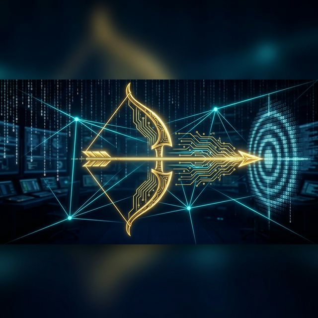
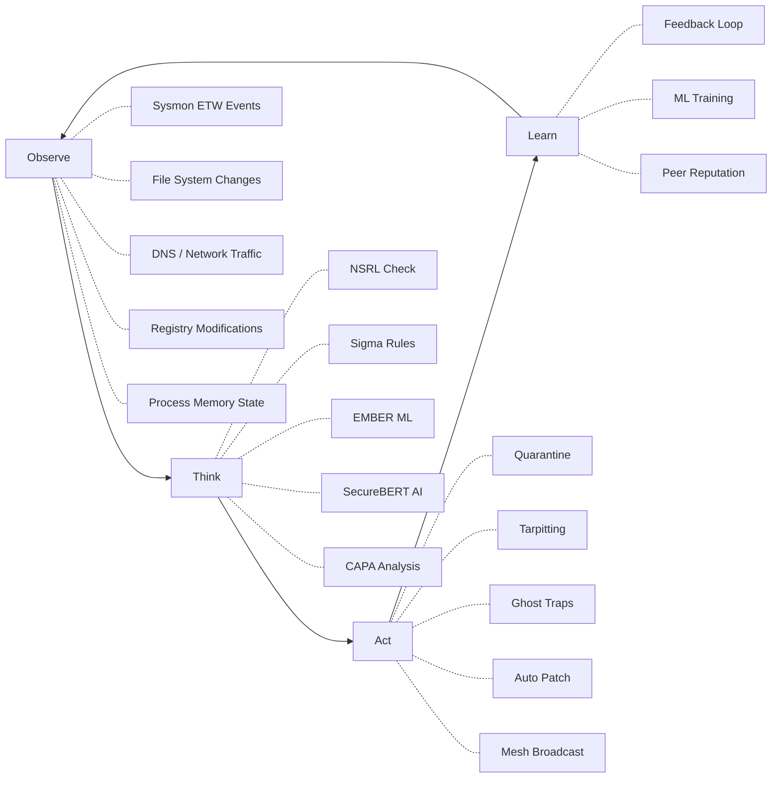
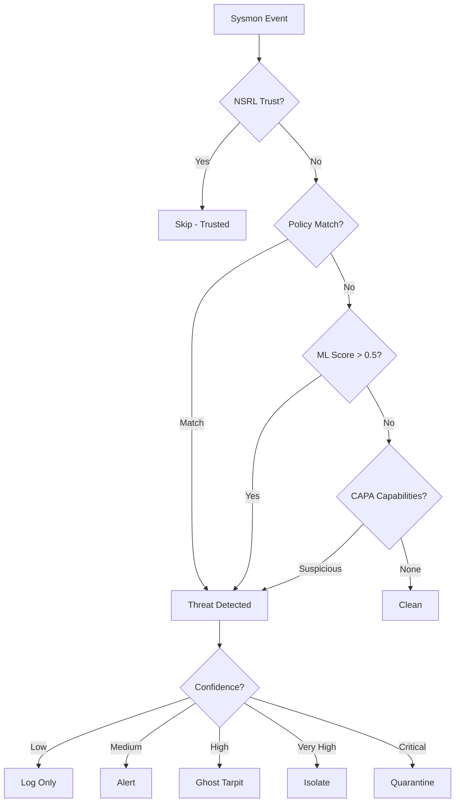
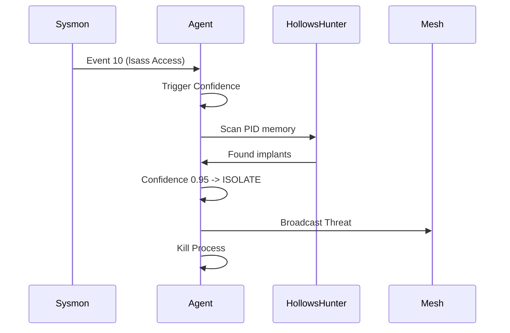

<p align="center">
  
</p>

<h1 align="center">🏹 OpenỌ̀ṣọ́ọ̀sì — OshoosiClaw</h1>
<h3 align="center"><em>The Decentralized Immune System for the Modern Endpoint</em></h3>

<p align="center">
  <a href="#-features"></a>
  <a href="#-detection-arsenal"></a>
  <a href="#-mesh-networking"></a>
  <a href="LICENSE"></a>
  <a href="#-architecture"></a>
</p>

<p align="center">
  <a href="#-quick-start">Quick Start</a> •
  <a href="#-architecture">Architecture</a> •
  <a href="#-detection-arsenal">Detection Arsenal</a> •
  <a href="#-cli-reference">CLI Reference</a> •
  <a href="#-contributing">Contributing</a>
</p>

---

> **Ọ̀ṣọ́ọ̀sì** *(oh-SHAW-aw-see)* is the Yoruba Orisha of the Hunt, Tracking, and Justice. In the Yoruba cosmological tradition, Ọ̀ṣọ́ọ̀sì is the divine tracker who **never misses his mark** — the archer whose arrow always finds its target. He is invoked for precision, the relentless pursuit of wrongdoers, and the swift delivery of justice.
>
> This is the spirit of this project: an autonomous security agent that **hunts threats with unerring accuracy**, **tracks adversaries across the mesh**, and **delivers swift, proportionate justice** through quarantine, isolation, and deception. Like Ọ̀ṣọ́ọ̀sì, it is both patient *(observing context, reasoning before action)* and decisive *(acting with confidence when the target is clear)*.

---

## 🎯 What Is OshoosiClaw?

**OshoosiClaw** is a next-generation, autonomous **Endpoint Detection & Response (EDR)** agent built entirely in **Rust**. It implements a **Decentralized Immune System** model where:

- 🔐 **Trust** is mathematically proven through Merkle Proofs and S2S Certificates
- 🔬 **Detection** is powered by a 6-engine forensic pipeline (EMBER ML + CAPA + FLOSS + HollowsHunter + YARA + ClamAV)
- 🧠 **Intelligence** is shared peer-to-peer across a **Million-Node Mesh** with Zonal Sharding and Reputation Filtering
- 🛡️ **Runtime Security** is hardened via **Native OS Sandboxing** (Landlock on Linux, Job Objects on Windows)
- 🛡️ **Optional Sandboxing**: NVIDIA OpenShell (Docker required ONLY for Central Gateway nodes)
- 🛡️ **Response** is autonomous — quarantine, tarpit, deceive, or heal — based on confidence thresholds

### Why Rust?

An EDR agent sits at the most critical juncture of a system. It must be:
- **Memory-safe** without a garbage collector (no buffer overflows, no use-after-free)
- **Blazing fast** for real-time telemetry processing (sub-millisecond event analysis)
- **Impossible to exploit** — the agent itself must never become the attack vector

Rust delivers all three. No compromises.

---

### 🧠 Multi-Tiered AI Architecture

OshoosiClaw does not rely on a single ML model. It uses a **cascading AI pipeline** for defense-in-depth:

| Model Tier | Engine | Purpose |
|:-----------|:-------|:--------|
| **File Identification** | [**Google Magika**](https://github.com/google/magika) | Deep learning-based pre-filtering. Identifies PE/ELF/Scripts before heavy analysis. |
| **Static Malware Detection** | [**EMBER ML**](https://github.com/elastic/ember) | Gradient-boosted tree model trained on 54 PE features (sections, imports, entropy). |
| **Behavioral NLP** | [**SecureBERT**](https://huggingface.co/ehsanaghaei/SecureBERT) | Security-domain BERT model that classifies PowerShell, CLI commands, and log sentences. |
| **Reasoning & Context** | [**Gemma 3 4B** / **Llama 3.1 8B**](https://ollama.com/) | Local LLMs (via Ollama) that reason about complex detection chains and decide on autonomous response. |

---

## 🤖 Agentic Architecture — True Autonomous Security

OshoosiClaw is not just a telemetry collector that sends logs to a cloud console for humans to review. It is a **true autonomous agent** with a real **Observe → Think → Act** loop:



### What Makes It Agentic?

| Capability | Traditional EDR | OshoosiClaw |
|:-----------|:---------------|:------------|
| **Detection** | Sends alerts to cloud console | Detects, analyzes, and decides **locally** |
| **Response** | Human analyst clicks "quarantine" | Autonomous quarantine when confidence > threshold |
| **Learning** | Vendor pushes signature updates | `learn_behavior()` trains on local feedback loops |
| **Healing** | IT admin applies patches manually | Repair Engine discovers + applies patches transactionally |
| **Collaboration** | Central server aggregates data | P2P mesh shares intelligence with differential privacy |
| **Deception** | Static honeypots (if any) | Dynamic Ghost Traps + Tarpitting + Holographic Sharding |
| **Reasoning** | Rule-based matching only | LLM agent reasons about context and acts |
| **Sandboxing** | Direct host execution | Hardened via **NVIDIA OpenShell** L7 policies |
| **Scalability** | Hub-and-spoke (bottleneck) | **Million-Node Mesh** with Zonal Sharding |
| **Provisioning** | Admin installs tools manually | Hardened, auditable pipeline via `SecuredExecutor` |

### The Autonomous Decision Matrix



### Sysmon -> HollowsHunter Reactive Chain

When Sysmon's **kernel driver** reports a suspicious event, OshoosiClaw automatically escalates to **memory forensics**:



---

## ⚡ Quick Start

### Prerequisites

| Component | Version | Purpose |
|:----------|:--------|:--------|
| **Rust** | 1.75+ | Core compilation |
| **Sysmon** | 15.0+ | Kernel-level telemetry (Windows) |
| **ClamAV** | 1.0+ | Signature-based AV scanning |
| **Ollama** | 0.1.0+ | Local LLM inference (optional) |

### Build From Source

```powershell
# Clone the repository
git clone https://github.com/oyesanyf/OshoosiClaw.git
cd OshoosiClaw

# Build with all features
cargo build --release --all-features

# One-time setup: install dependencies + grant permissions
.\target\release\osoosi.exe grant-access

# Start the autonomous security loop
.\target\release\osoosi.exe start
```

### Docker (Coming Soon)

```bash
docker pull oyesanyf/oshoosiclaw:latest
docker run --privileged --net=host oyesanyf/oshoosiclaw
```

---

## 🏛️ Architecture

OshoosiClaw is built as a **modular monolith** — 20 specialized crates that compile into a single, high-performance binary.

```
┌─────────────────────────────────────────────────────────────────────┐
│                        OshoosiClaw Agent                            │
├─────────────────────────────────────────────────────────────────────┤
│  ┌──────────┐  ┌──────────┐  ┌──────────┐  ┌──────────────────┐   │
│  │ Osoosi   │  │ Ogun     │  │ Erinle   │  │ Ode              │   │
│  │ Scanner  │  │ Kernel   │  │ Healer   │  │ Orchestrator     │   │
│  │ (User)   │  │ (Sysmon) │  │ (Repair) │  │ (Core Service)   │   │
│  └────┬─────┘  └────┬─────┘  └────┬─────┘  └────────┬─────────┘   │
│       │              │              │                 │             │
│  ┌────▼──────────────▼──────────────▼─────────────────▼──────────┐ │
│  │                    EdrOrchestrator                             │ │
│  │  ┌─────────────────────────────────────────────────────────┐  │ │
│  │  │              Detection Pipeline (6 Engines)              │  │ │
│  │  │  Magika → ClamAV → YARA → EMBER ML → CAPA → FLOSS      │  │ │
│  │  └─────────────────────────────────────────────────────────┘  │ │
│  │  ┌─────────────────────────────────────────────────────────┐  │ │
│  │  │            Memory Forensics (HollowsHunter)              │  │ │
│  │  │  Sysmon ETW → ProcessAccess/lsass → Memory Scan → Alert  │  │ │
│  │  └─────────────────────────────────────────────────────────┘  │ │
│  │  ┌─────────────────────────────────────────────────────────┐  │ │
│  │  │              Behavioral AI Cascade                       │  │ │
│  │  │  CoLog Anomaly → SecureBERT → Gemma 3 → OpenAI          │  │ │
│  │  └─────────────────────────────────────────────────────────┘  │ │
│  └───────────────────────────────────────────────────────────────┘ │
│       │              │              │                 │             │
│  ┌────▼────┐  ┌──────▼────┐  ┌─────▼────┐  ┌────────▼──────────┐ │
│  │ SQLite  │  │ libp2p    │  │ Merkle   │  │ Active            │ │
│  │ Memory  │  │ Mesh      │  │ Audit    │  │ Response          │ │
│  │ Store   │  │ Network   │  │ Trail    │  │ (Ghost/Tarpit)    │ │
│  └─────────┘  └───────────┘  └──────────┘  └───────────────────┘ │
└─────────────────────────────────────────────────────────────────────┘
```

### Crate Map

| Crate | Yoruba Spirit | Responsibility |
|:------|:-------------|:---------------|
| `osoosi-cli` | — | CLI interface for managing and running the agent |
| `osoosi-core` | **Ode** *(Orchestrator)* | Coordinates telemetry, policy, mesh, and response |
| `osoosi-telemetry` | **Ogun** *(Iron Layer)* | Cross-platform event ingestion (Sysmon/Auditd/ESF) + FIM |
| `osoosi-policy` | — | Detection engines (STGC, Sigma, KEV, NSRL feeds) |
| `osoosi-model` | — | ML model training, Magika/ClamAV malware scanning |
| `osoosi-behavioral` | — | SecureBERT + Gemma 3 + OpenAI behavioral AI |
| `osoosi-wire` | — | P2P mesh (libp2p Gossipsub), peer join gate, reputation |
| `osoosi-trust` | — | Identity (DID), Merkle Proofs, certificate issuing |
| `osoosi-audit` | — | Tamper-evident Merkle Logchain |
| `osoosi-repair` | **Erinle** *(Healer)* | Patch discovery and transactional patch engine |
| `osoosi-runtime` | — | Active response: deception (ghost files) and tarpit |
| `osoosi-memory` | — | Local SQLite persistence and threat intelligence store |
| `osoosi-dashboard` | — | Web dashboard UI and API endpoints (Axum) |
| `osoosi-sandbox` | — | WASM sandbox for isolated tool execution |
| `osoosi-dp` | — | Differential privacy + Fully Homomorphic Encryption |
| `osoosi-hexpatch` | — | Dynamic binary self-healing (HexPatch) |
| `osoosi-exporter` | — | Telemetry exporter (SIEM/Webhook integration) |
| `osoosi-types` | — | Unified data schemas for all crate communication |
| `hex-patch` | — | Binary patching utility |
| `test-peer` | — | P2P mesh testing utility |

---

## 🔬 Detection Arsenal

OshoosiClaw uses a **six-engine detection pipeline** — a depth of analysis that exceeds most commercial EDR products.

### The Mandiant Forensic Trio

| Tool | What It Does | Detects |
|:-----|:-------------|:--------|
| **CAPA** | Extracts binary *capabilities* | What can this file DO? (keylogging, C2, exfiltration) |
| **FLOSS** | De-obfuscates hidden strings | Hidden C2 domains, IPs, API keys, config data |
| **HollowsHunter** | Scans live process memory | Process hollowing, DLL injection, shellcode, API hooks |

### Full Detection Stack

| Layer | Engine | Technique | Coverage |
|:------|:-------|:----------|:---------|
| 1️⃣ | **Magika** (Google) | AI file-type identification | Prevents extension spoofing |
| 2️⃣ | **ClamAV** | Signature-based AV | 8M+ known malware signatures |
| 3️⃣ | **YARA** | Pattern matching rules | Custom + community threat rules |
| 4️⃣ | **EMBER ML** | 54-feature PE static analysis | Zero-day malware classification |
| 5️⃣ | **Mandiant CAPA** | Capability extraction | Behavioral intent analysis |
| 6️⃣ | **Mandiant FLOSS** | String de-obfuscation | Hidden C2/config extraction |
| 7️⃣ | **HollowsHunter** | Live memory forensics | In-memory implant detection |

### Sysmon Event Coverage (Complete)

OshoosiClaw processes **ALL 25+ Sysmon event types**:

| Category | Event IDs | Detection Purpose |
|:---------|:----------|:------------------|
| **Execution & Memory** | 1, 5, 8, 10, 25 | Process creation, injection, LSASS access, tampering |
| **File System** | 2, 11, 15, 23, 26, 27, 28, 29 | Timestomping, file drops, ADS, ransomware, shredding |
| **Registry** | 12, 13, 14 | Persistence mechanisms (Run keys, services) |
| **Network** | 3, 17, 18, 22 | C2 beaconing, lateral movement, DNS exfiltration |
| **System** | 4, 6, 7, 9, 16, 19-21, 24, 255 | Rootkits, DLL sideloading, WMI persistence, clipboard |

### Behavioral AI Cascade

```
Event → CoLog Autonomous Sequence Anomaly Detection
          ↓ (if score > 0.7)
        SecureBERT Classification (local model)
          ↓ (if suspicious)
        Gemma 3 4B Reasoning (via Ollama)
          ↓ (fallback)
        OpenAI GPT Analysis (cloud API)
```

---

## 🛡️ Active Defense Features

### Ghost Trap Canary System
Deploys realistic decoy files across the filesystem:
- `CEO_Private_Strategy_2025.docx`
- `Production_DB_Keys.env`
- `Backup_Credentials_FINAL.xlsx`

Any unauthorized access triggers an **immediate alert** with full forensic context.

### Egress Tarpitting
Instead of blocking suspicious connections outright, OshoosiClaw **throttles** them — slowing data exfiltration to a crawl while gathering intelligence on the attacker's C2 infrastructure.

### Holographic Deception Sharding (HDS)
When an attacker IP is flagged, the P2P mesh creates a **distributed hallucination**: the SSH service appears on Node A in Tokyo, the database on Node B in Berlin, and the web server on Node C in NYC. The attacker perceives a single target; the mesh perceives a harvest.

### Einsteinian Relativistic Guard
Treats the system as a **Causal Manifold**:
- **Light-Cone Integrity**: Every event is hashed with its causal parent. Mismatches indicate code injection.
- **Temporal Dilation**: Detects discrepancies between local CPU time and mesh time, catching backdating and sleeper malware.

---

## 🌐 Mesh Networking

OshoosiClaw agents form a **decentralized P2P mesh** using libp2p Gossipsub:

| Feature | Description |
|:--------|:------------|
| **DID Identity** | Every agent has a unique `did:osoosi` cryptographic identity |
| **Mutual Attestation** | Agents verify each other's binary integrity via challenge-response |
| **Zonal Sharding** | Nodes organized by zone/industry to support **Million-Node Scale** |
| **Reputation Filter** | Gossip prioritization based on top 1% most trusted nodes |
| **Differential Privacy** | Threat intelligence is shared with Laplacian noise to prevent fingerprinting |
| **Reputation Scoring** | Peers earn trust through consistent, accurate threat reports |
| **Shadow Chain** | Distributed immutable audit ledger prevents log tampering |

---

## 💻 CLI Reference

### `start` — Launch the Autonomous Security Loop

```powershell
.\osoosi.exe start
```

Starts all detection engines, file watchers, mesh networking, behavioral analysis, and the web dashboard.

### `grant-access` — One-Time System Setup

```powershell
.\osoosi.exe grant-access
```

Automated provisioning pipeline:
1. ✅ Configures firewall rules (mesh + dashboard ports)
2. ✅ Grants read-only access to security event logs
3. ✅ Provisions ClamAV, OpenSSL, Ollama
4. ✅ Downloads **Mandiant FLOSS** (string de-obfuscation)
5. ✅ Downloads **HollowsHunter** (memory forensics)
6. ✅ Begins NSRL "Known Good" database download (121 GB, background)

### `agent` — LLM Reasoning Agent

```powershell
.\osoosi.exe agent
```

Launches the autonomous LLM agent (Llama 3.1 8B via Ollama + LangChain) for context-aware security reasoning.

### `trust` — Identity & Certificate Management

```powershell
# View your agent's DID identity
.\osoosi.exe trust who-am-i

# Initialize as a Root CA
.\osoosi.exe trust init-ca

# Issue an mTLS certificate for a peer
.\osoosi.exe trust issue --peer-did did:osoosi:abc123... --out ./certs/peer_node_1
```

### `story` — Forensic Narrative

```powershell
.\osoosi.exe story
```

Generates a human-readable forensic attack narrative from the Merkle Audit Trail.

### `status` — Health Check

```powershell
.\osoosi.exe status
```

Reports agent health, mesh connectivity, detection engine status, and NSRL database coverage.

---

## 🧠 LLM Agent (Autonomous Reasoning)

OshoosiClaw integrates a local LLM agent that embodies Ọ̀ṣọ́ọ̀sì's role as the divine tracker:

| Ọ̀ṣọ́ọ̀sì Attribute | Agent Capability |
|:-------------------|:----------------|
| **Observation** — reads the forest | Polls live context: peers, threats, malware, patches |
| **Tracking** — follows the trail | Reasons about reputation scores, confidence levels, patterns |
| **Judgment** — aims the arrow | Decides: approve peer, deny peer, trigger patch, release quarantine |
| **Precision** — never misses | Conservative by default; only acts when confidence is high |

```powershell
# Auto-spawn with the main agent
$env:OSOOSI_LLM_AGENT_ENABLED="1"
.\osoosi.exe start
```

---

## 📋 Requirements

### System Requirements

| Platform | Minimum | Recommended |
|:---------|:--------|:------------|
| **OS** | Windows 10/11, Ubuntu 20.04+, macOS 12+ | Windows Server 2022, Ubuntu 22.04 |
| **RAM** | 4 GB | 8 GB+ |
| **Disk** | 2 GB (agent) + 130 GB (NSRL) | 256 GB SSD |
| **CPU** | x86_64, 2 cores | 4+ cores |
| **Network** | Internet (threat feeds) | Static IP (mesh stability) |

### Build Requirements

| Dependency | Version | Install |
|:-----------|:--------|:--------|
| **Rust** | 1.75+ | [rustup.rs](https://rustup.rs) |
| **Visual Studio Build Tools** | 2022 | [Visual Studio](https://visualstudio.microsoft.com/downloads/) (Windows) |
| **OpenSSL** | 3.0+ | Auto-provisioned via `grant-access` |
| **pkg-config** | Latest | `apt install pkg-config` (Linux) |

### Optional Dependencies

| Tool | Purpose | Auto-Provisioned? |
|:-----|:--------|:------------------|
| **Sysmon** | Kernel-level telemetry (Windows) | ✅ Yes |
| **ClamAV** | Signature-based antivirus | ✅ Yes |
| **Ollama** | Local LLM inference | ✅ Yes |
| **FLOSS** | String de-obfuscation | ✅ Yes |
| **HollowsHunter** | Memory forensics | ✅ Yes |
| **OpenSSL** | Cryptographic operations | ✅ Yes |

### Environment Variables

| Variable | Default | Description |
|:---------|:--------|:------------|
| `OSOOSI_LLM_AGENT_ENABLED` | `0` | Enable LLM agent auto-spawn |
| `ORT_DYLIB_PATH` | Auto-detect | Path to ONNX Runtime DLL |
| `OSOOSI_MODELS_DIR` | `models/` | ML model directory |
| `OSOOSI_SIGMA_DIR` | `sigma/` | Sigma rules directory |
| `OSOOSI_DATA_DIR` | `data/` | Behavioral learning data |
| `OSOOSI_OFFLINE_MODE` | `false` | Disable external API calls |
| `OTX_API_KEY` | — | AlienVault OTX API key |
| `OPENAI_API_KEY` | — | OpenAI API key (behavioral fallback) |
| `OSOOSI_NO_ORT` | `false` | Disable ONNX Runtime |

---

## 🔒 Security

> **OshoosiClaw takes security seriously.**

- **Configuration Integrity**: `osoosi.toml` and policy files are **OpenSSL-signed**. The agent **hard refuses** to start if signatures are invalid.
- **Sandboxed Execution**: 
    - **Endpoints (Million-Node Scale)**: Uses zero-dependency **Native OS Sandboxing** (Landlock for Linux, Job Objects/AppContainer for Windows). **NO DOCKER REQUIRED** on endpoint nodes.
    - **Central Gateway**: Supports **NVIDIA OpenShell** for heavyweight forensics and policy orchestration. Docker is only required if you choose to deploy a Central OpenShell Gateway.
- **Tamper-Evident Logging**: All events are recorded in a Merkle Logchain. Any modification is cryptographically detectable.
- **Differential Privacy**: Threat intelligence shared across the mesh includes Laplacian noise to prevent fingerprinting.

For vulnerability reports, see [SECURITY.md](SECURITY.md).

---

## 🤝 Contributing

We welcome contributions! See [CONTRIBUTING.md](CONTRIBUTING.md) for guidelines.

### Development Setup

```powershell
git clone https://github.com/oyesanyf/OshoosiClaw.git
cd OshoosiClaw
cargo build --all-features
cargo test --all-features
```

### Code Style

- Follow `rustfmt` defaults
- Run `cargo clippy` before submitting PRs
- All public APIs must have doc comments

---

## 📜 License

This project is licensed under the MIT License — see the [LICENSE](LICENSE) file for details.

---

## 🌱 Inspired By OpenFang

OshoosiClaw stands on the shoulders of the [**OpenFang**](https://github.com/OpenFang) project — a pioneering open-source EDR framework that demonstrated what community-driven endpoint security could look like. OpenFang's groundbreaking work in **lattice-based taint tracking**, **decentralized trust models**, and **autonomous response patterns** directly shaped the architecture of OshoosiClaw.

Where OpenFang laid the theoretical foundation, OshoosiClaw extends it with:
- A **Rust-native** implementation for memory safety and performance
- The **Mandiant Forensic Trio** (CAPA + FLOSS + HollowsHunter) for deep binary analysis
- **Behavioral AI cascading** (SecureBERT → Gemma 3 → OpenAI) for intelligent classification
- **Active deception** (Ghost Traps, Tarpitting, Holographic Sharding) for adversary frustration
- A **P2P mesh** with differential privacy for decentralized threat intelligence

We honour OpenFang's vision by building upon it and pushing it further — into the next generation of autonomous, decentralized security.

---

## 🙏 Acknowledgments

The name **Ọ̀ṣọ́ọ̀sì** honours the Yoruba cosmological tradition and the Orisha of the Hunt, whose qualities of precision, justice, and relentless pursuit define the spirit of this project.

### Third-Party Tools & Integrations

| Tool | Author | License | Purpose |
|:-----|:-------|:--------|:--------|
| [CAPA](https://github.com/mandiant/capa) | Mandiant / Google | Apache 2.0 | Binary capability extraction |
| [FLOSS](https://github.com/mandiant/flare-floss) | Mandiant / Google | Apache 2.0 | Obfuscated string de-obfuscation |
| [HollowsHunter](https://github.com/hasherezade/hollows_hunter) | hasherezade / Google | BSD 2-Clause | Live process memory forensics |
| [PE-sieve](https://github.com/hasherezade/pe-sieve) | hasherezade / Google | BSD 2-Clause | In-memory PE scanning engine |
| [Sysmon](https://learn.microsoft.com/sysinternals/downloads/sysmon) | Microsoft Sysinternals | Sysinternals EULA | Kernel-level ETW telemetry driver |
| [ClamAV](https://www.clamav.net/) | Cisco Talos | GPL 2.0 | Signature-based antivirus scanning |
| [Ollama](https://ollama.com/) | Ollama Inc. | MIT | Local LLM inference (Llama 3.1 8B, Gemma 3)  |
| [OpenSSL](https://www.openssl.org/) | OpenSSL Project | Apache 2.0 | Cryptographic operations & TLS |
| [YARA](https://virustotal.github.io/yara/) | VirusTotal / Google | BSD 3-Clause | Pattern matching for threat detection |
| [Sigma](https://sigmahq.io/) | SigmaHQ Community | LGPL 2.1 | Generic log detection rules |
| [NSRL RDS](https://www.nist.gov/itl/ssd/software-quality-group/national-software-reference-library-nsrl) | NIST | Public Domain | Known-good software hash database (121 GB) |
| [Magika](https://github.com/google/magika) | Google | Apache 2.0 | AI-powered file type identification |
| [AlienVault OTX](https://otx.alienvault.com/) | AT&T Cybersecurity | Free API | Open threat intelligence indicators |

### Rust Crate Dependencies

| Crate | Author | Purpose |
|:------|:-------|:--------|
| [tokio](https://tokio.rs/) | Tokio Contributors | Async runtime for concurrent event processing |
| [libp2p](https://github.com/libp2p/rust-libp2p) | Protocol Labs | P2P mesh networking (Gossipsub, Kademlia) |
| [axum](https://github.com/tokio-rs/axum) | Tokio Contributors | Web dashboard HTTP server |
| [reqwest](https://github.com/seanmonstar/reqwest) | Sean McArthur | HTTP client for threat feed downloads |
| [serde](https://serde.rs/) | David Tolnay | Serialization / deserialization framework |
| [rusqlite](https://github.com/rusqlite/rusqlite) | rusqlite Contributors | SQLite database bindings |
| [goblin](https://github.com/m4b/goblin) | m4b | PE/ELF/Mach-O binary parsing (EMBER features) |
| [ort](https://github.com/pykeio/ort) | pyke.io | ONNX Runtime bindings for ML inference |
| [ed25519-dalek](https://github.com/dalek-cryptography/curve25519-dalek) | Dalek Cryptography | Ed25519 signing (DID trust model) |
| [sha2](https://github.com/RustCrypto/hashes) | RustCrypto | SHA-256 hashing (config integrity) |
| [chrono](https://github.com/chronotope/chrono) | Chronotope | Date/time handling (temporal analysis) |
| [tracing](https://github.com/tokio-rs/tracing) | Tokio Contributors | Structured logging framework |
| [sysinfo](https://github.com/GuillaumeGomez/sysinfo) | Guillaume Gomez | System/process resource monitoring |
| [walkdir](https://github.com/BurntSushi/walkdir) | Andrew Gallant | Recursive directory traversal |
| [dashmap](https://github.com/xacrimon/dashmap) | Joel Wejdenstål | Concurrent hashmap (NSRL cache) |
| [wasmtime](https://wasmtime.dev/) | Bytecode Alliance | WASM sandbox runtime |
| [regex](https://github.com/rust-lang/regex) | Rust Project | Pattern matching (FLOSS output parsing) |
| [anyhow](https://github.com/dtolnay/anyhow) | David Tolnay | Ergonomic error handling |
| [clap](https://github.com/clap-rs/clap) | clap Contributors | CLI argument parsing |

### AI Models & Frameworks

| Model / Framework | Provider | Purpose |
|:-------------------|:---------|:--------|
| [SecureBERT](https://huggingface.co/ehsanaghaei/SecureBERT) | Ehsan Aghaei | Security-domain NLP classification |
| [Gemma 3 4B](https://ai.google.dev/gemma) | Google DeepMind | Local behavioral reasoning (via Ollama) |
| [Llama 3.1 8B](https://llama.meta.com/) | Meta AI | Autonomous agent reasoning (via Ollama) |
| [EMBER](https://github.com/elastic/ember) | Elastic / Endgame | PE feature extraction methodology (54 features) |
| [LangChain](https://python.langchain.com/) | LangChain Inc. | LLM agent orchestration framework |
| [ONNX Runtime](https://onnxruntime.ai/) | Microsoft | ML model inference engine |

---

<p align="center">
  <strong>Built with ❤️ in Rust for the next generation of decentralized security.</strong>
  <br/>
  <em>"Like Ọ̀ṣọ́ọ̀sì, it is both patient and decisive."</em>
</p>
