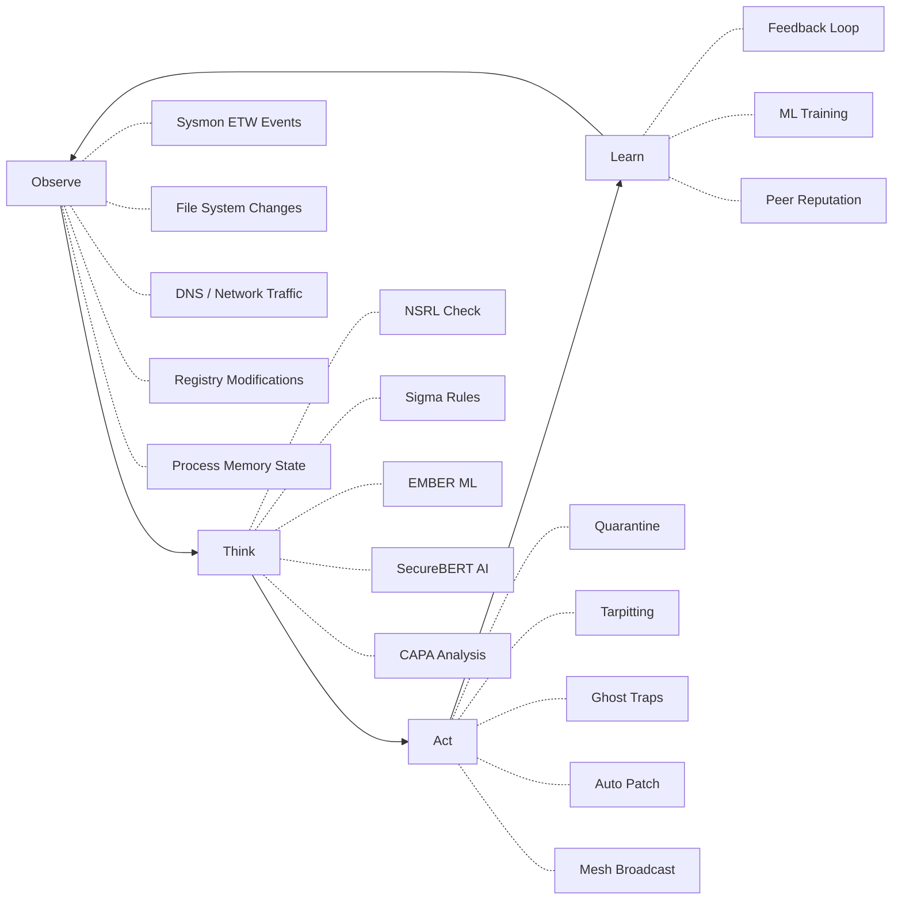
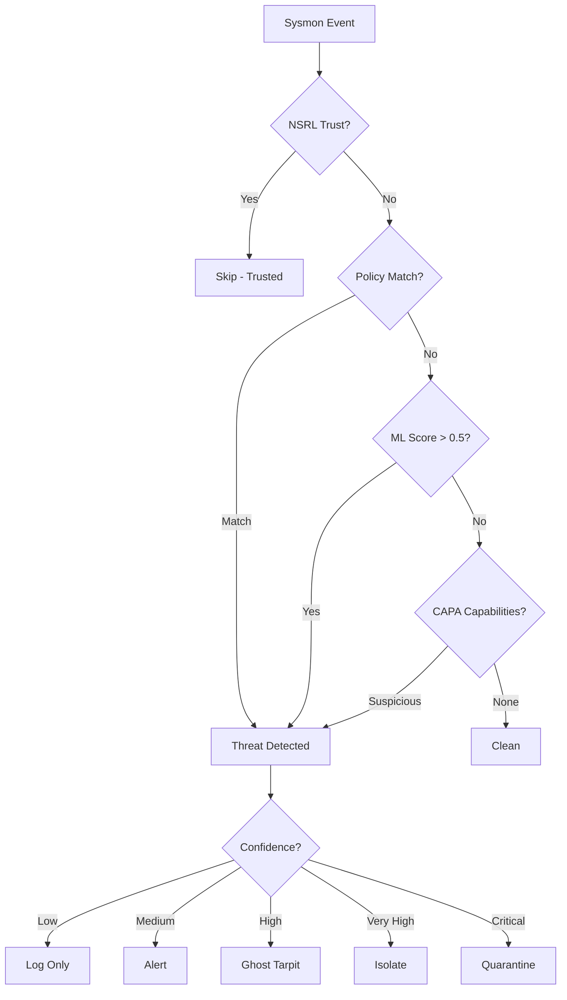
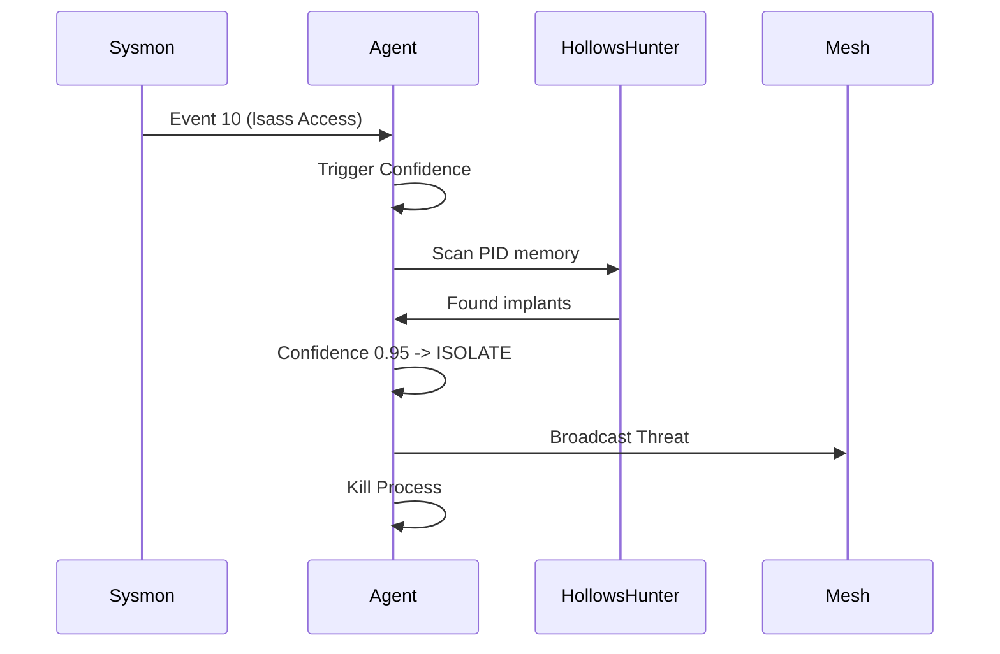
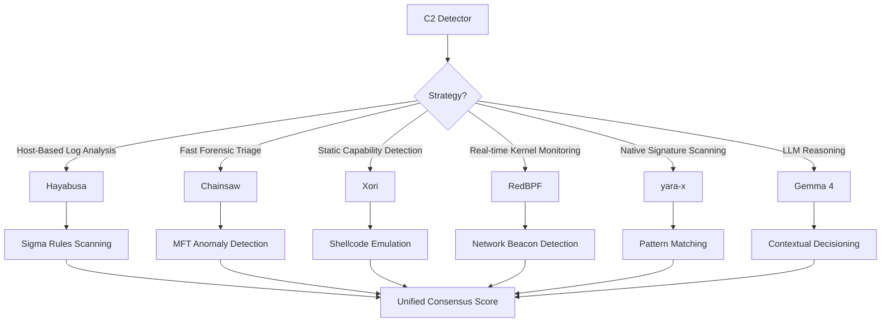
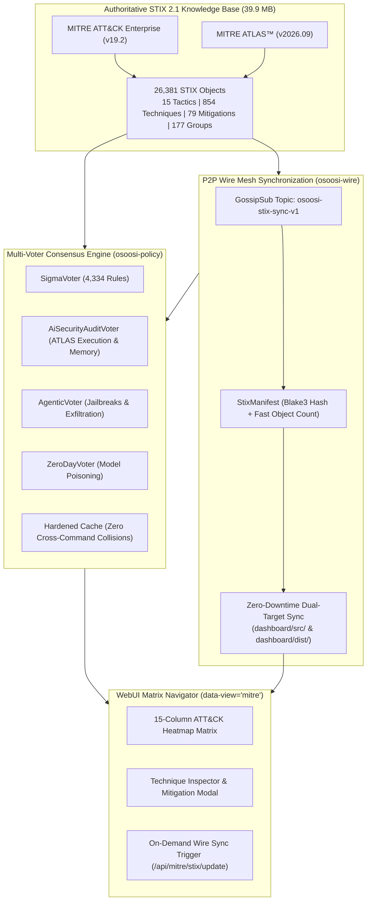

<p align="center">
  
</p>

<h1 align="center">🏹 OpenỌ̀ṣọ́ọ̀sì — OshoosiClaw</h1>
<h3 align="center"><em>The Decentralized Immune System for the Modern Endpoint</em></h3>

<p align="center">
  <a href="#-features"></a>
  <a href="#-features"></a>
  <a href="#-mitre-attck--atlas-enterprise-framework"></a>
  <a href="#-mesh-networking"></a>
  <a href="#-architecture"></a>
  <a href="#-adversarial-verification"></a>
  <a href="LICENSE"></a>
</p>

<p align="center">
  <a href="#-quick-start">Quick Start</a> •
  <a href="#-architecture">Architecture</a> •
  <a href="#-dns-telemetry-setup">DNS & Sysmon Setup</a> •
  <a href="#-two-host-mesh-consensus">Two-Host BFT Mesh</a> •
  <a href="#-adversarial-verification">Adversarial Testing</a> •
  <a href="#-synthetic-telemetry-canaries--anti-blinding-engine">Canary Anti-Blinding</a> •
  <a href="#-mitre-attck--atlas-enterprise-framework">MITRE ATT&CK & ATLAS</a> •
  <a href="#-p2p-wire-mesh-stix-synchronization">Wire STIX Sync</a> •
  <a href="#-high-throughput-p2p-mesh--consensus-stability">Mesh Stability</a> •
  <a href="#-cli-reference">CLI Reference</a>
</p>

---

> **Ọ̀ṣọ́ọ̀sì** *(oh-SHAW-aw-see)* is the Yoruba Orisha of the Hunt, Tracking, and Justice. In the Yoruba cosmological tradition, Ọ̀ṣọ́ọ̀sì is the divine tracker who **never misses his mark** — the archer whose arrow always finds its target. He is invoked for precision, the relentless pursuit of wrongdoers, and the swift delivery of justice.
>
> This is the spirit of this project: an autonomous security agent that **hunts threats with unerring accuracy**, **tracks adversaries across the mesh**, and **delivers swift, proportionate justice** through quarantine, isolation, and deception. Like Ọ̀ṣọ́ọ̀sì, it is both patient *(observing context, reasoning before action)* and decisive *(acting with confidence when the target is clear)*.

---

## 🎯 What Is OshoosiClaw?

**OshoosiClaw** is a next-generation, autonomous **Endpoint Detection & Response (EDR)** agent built entirely in **Rust**. It implements a **Decentralized Immune System** model where:

- 🔐 **Trust** is mathematically proven through Merkle Proofs and S2S Certificates
- 🔬 **Detection** is powered by a **Unified Agentic Engine** (Sigma-X + Atomic IOC + SecureBERT + SOREL-20M + EMBER v2 + CAPA + FLOSS + HollowsHunter + YARA-X + ClamAV + Hayabusa + Chainsaw + Xori + RedBPF + Gemma 4 + Ollama)
- 🧠 **Intelligence** is shared peer-to-peer across a **Million-Node Mesh** with Zonal Sharding and Reputation Filtering
- 🛡️ **Runtime Security** is hardened via **Native OS Sandboxing** (Landlock on Linux, Job Objects on Windows)
- 🛡️ **Optional Sandboxing**: NVIDIA OpenShell (Docker required ONLY for Central Gateway nodes)
- 🔐 **Native Cryptography**: Integrated **`rust-openssl` (vendored)** for zero-dependency identity and trust management.
- 🛡️ **Response** is autonomous — quarantine, tarpit, deceive, or heal — based on confidence thresholds

### Why Rust?

An EDR agent sits at the most critical juncture of a system. It must be:
- **Memory-safe** without a garbage collector (no buffer overflows, no use-after-free)
- **Blazing fast** for real-time telemetry processing (sub-millisecond event analysis)
- **Impossible to exploit** — the agent itself must never become the attack vector

Rust delivers all three. No compromises.

---

### 🧠 Multi-Tiered AI Architecture

OshoosiClaw does not rely on a single ML model. It uses a **cascading AI pipeline** for defense-in-depth:

| Model Tier | Engine | Purpose |
|:-----------|:-------|:--------|
| **File Identification** | [**Google Magika**](https://github.com/google/magika) | Deep learning-based pre-filtering. Identifies PE/ELF/Scripts before heavy analysis. |
| **Precision Guardrail** | **Shannon Entropy** | Differentiates between legitimate browsers/tools and packed malware. |
| **Forensic Storytelling**| **OpenTelemetry (OTel)** | Wraps suspicious events into a context-rich forensic story instead of disconnected alerts. |
| **Static Malware Detection** | [**SOREL-20M**](https://github.com/sophos-ai/SOREL-20M) / [**EMBER**](https://github.com/elastic/ember) | Triple-model consensus (FFNN, LightGBM, MalConv) using 2,381-dimension EMBER v2 features. |
| **Behavioral NLP** | [**SecureBERT**](https://huggingface.co/ehsanaghaei/SecureBERT) | Security-domain BERT model that classifies PowerShell, CLI commands, and log sentences. |
| **Reasoning & Context** | [**Gemma 4 9B** / **Llama 3.1 8B**](https://ollama.com/) | Local LLMs (via Ollama) that reason about complex detection chains and decide on autonomous response. |
| **Logic Engine** | **Sigma Engine** | High-performance Sigma rule evaluation with LogSource-aware indexing. |
| **Indicator Matching** | **Atomic IOC** | Constant-time (O(1)) matching for malicious hashes, IPs, and domains. |

---

## 🤖 Agentic Architecture — True Autonomous Security

OshoosiClaw is not just a telemetry collector that sends logs to a cloud console for humans to review. It is a **true autonomous agent** with a real **Observe → Think → Act** loop:


```mermaid
graph LR
    A[Observe] --> B[Think]
    B --> C[Act]
    C --> D[Learn]
    D --> A
    
    A -.- A1[Sysmon ETW Events]
    A -.- A2[File System Changes]
    A -.- A3[DNS / Network Traffic]
    A -.- A4[Registry Modifications]
    A -.- A5[Process Memory State]
    
    B -.- B1[NSRL Check]
    B -.- B2[Sigma Rules]
    B -.- B3[EMBER ML]
    B -.- B4[SecureBERT AI]
    B -.- B5[CAPA Analysis]
    
    C -.- C1[Quarantine]
    C -.- C2[Tarpitting]
    C -.- C3[Ghost Traps]
    C -.- C4[Auto Patch]
    C -.- C5[Mesh Broadcast]
    
    D -.- D1[Feedback Loop]
    D -.- D2[ML Training]
    D -.- D3[Peer Reputation]
```

### What Makes It Agentic?

| Capability | Traditional EDR | OshoosiClaw |
|:-----------|:---------------|:------------|
| **Detection** | Sends alerts to cloud console | Detects, analyzes, and decides **locally** |
| **Response** | Human analyst clicks "quarantine" | Autonomous quarantine when confidence > threshold |
| **Learning** | Vendor pushes signature updates | `learn_behavior()` trains on local feedback loops |
| **Healing** | IT admin applies patches manually | Repair Engine discovers + applies patches transactionally |
| **Collaboration** | Central server aggregates data | P2P mesh shares intelligence with differential privacy |
| **Deception** | Static honeypots (if any) | Dynamic Ghost Traps + Tarpitting + Holographic Sharding |
| **Reasoning** | Rule-based matching only | LLM agent reasons about context and acts |
| **Sandboxing** | Direct host execution | Hardened via **NVIDIA OpenShell** L7 policies |
| **Scalability** | Hub-and-spoke (bottleneck) | **Million-Node Mesh** with Zonal Sharding |
| **Provisioning** | Admin installs tools manually | Hardened, auditable pipeline via `SecuredExecutor` |
| **Agent Defense** | Blind to AI/Agentic attacks | Real-time AI tool-injection, memory poisoning, & egress voters |

### AI Agent Security & Cloudflare Audit Integration

OshoosiClaw incorporates an on-device threat matrix designed specifically for autonomous agent runtimes, integrating the **Cloudflare Security Audit Framework** into active EDR consensus:

- **`AiSecurityAuditVoter`**: Evaluates Sysmon telemetry against prompt and tool injection attacks:
  - **Tool-Argument Injection**: Intercepts command chaining (`;`, `&&`, `|`), encoded PowerShell commands, and directory traversals (`../`, `..\`) executed via agent tool calls.
  - **Agent State & Memory Poisoning**: Blocks untrusted writes (Sysmon Event 11) targeting `.agents/memory.md`, `.agents/rules/`, and `osoosi.toml`.
  - **Process Memory Safety**: Flags unauthorized code/remote thread injection (Sysmon Events 8 & 10) into AI inference processes.
- **`AgenticPolicyVoter`**: Detects agentic breakout, policy violations, and adversarial prompt drift using dynamic minimax defense.
- **`AgentEgressVoter`**: Inspects network egress for DNS covert channels, exfiltration bursts, and suspicious endpoints.
- **CyberShield Developer & Inference Guardrails**: Local LLM runtimes (`llama-server.exe`, `ollama`, `vllm`) are recognized and safeguarded with strict C2 verification ($\ge 0.95$ threshold) before any defensive suspension actions.

### The Autonomous Decision Matrix


```mermaid
graph TD
    E[Sysmon Event] --> F{NSRL Trust?}
    F -->|Yes| G[Skip - Trusted]
    F -->|No| H{Policy Match?}
    H -->|No| I{ML Score > 0.5?}
    H -->|Match| J[Threat Detected]
    I -->|No| K{CAPA Capabilities?}
    I -->|Yes| J
    K -->|None| L[Clean]
    K -->|Suspicious| J
    J --> M{Confidence?}
    M -->|Low| N[Log Only]
    M -->|Medium| O[Alert]
    M -->|High| P[Ghost Tarpit]
    M -->|Very High| Q[Isolate]
    M -->|Critical| R[Quarantine]
```

### Sysmon -> HollowsHunter Reactive Chain

When Sysmon's **kernel driver** reports a suspicious event, OshoosiClaw automatically escalates to **memory forensics**:


```mermaid
sequenceDiagram
    participant K as Sysmon
    participant O as Agent
    participant H as HollowsHunter
    participant M as Mesh
    
    K->>O: Event 10 (lsass Access)
    O->>O: Trigger Confidence
    O->>H: Scan PID memory
    H->>O: Found implants
    O->>O: Confidence 0.95 -> ISOLATE
    O->>M: Broadcast Threat
    O->>O: Kill Process
```

### C2 Detection Strategy (Windows/Linux/macOS)

OshoosiClaw implements a hybrid C2 detection model combining native Rust scanning with industry-standard behavioral engines:


```mermaid
graph TD
    A[C2 Detector] --> B{Strategy?}
    B -->|Host-Based Log Analysis| C[Hayabusa]
    B -->|Fast Forensic Triage| D[Chainsaw]
    B -->|Static Capability Detection| E[Xori]
    B -->|Real-time Kernel Monitoring| F[RedBPF]
    B -->|Native Signature Scanning| G[yara-x]
    B -->|LLM Reasoning| H[Gemma 4]
    
    C --> I[Sigma Rules Scanning]
    D --> J[MFT Anomaly Detection]
    E --> K[Shellcode Emulation]
    F --> L[Network Beacon Detection]
    G --> M[Pattern Matching]
    H --> N[Contextual Decisioning]
    
    I & J & K & L & M & N --> O[Unified Consensus Score]
```

### 🧬 Autonomous Forensics & Lineage Discovery (New)

OshoosiClaw 1.2 introduces **Autonomous Lineage Auditing**, allowing the agent to reason about threats based on their full behavioral ancestry:

- **Recursive Process Walking**: The agent walks up the host's process tree to build a complete lineage (e.g., `cmd.exe` ← `powershell.exe` ← `wsmprovhost.exe`).
- **Contextual Risk Scoring**: The 100k-CVE brain scores processes based on the *combination* of product name, version, and ancestry.
- **Dynamic Feature Learning**: The model extracts features from observed lineages and autonomously builds a "Baseline of Normality" for the host environment.
- **PE-Native Discovery**: The `audit` command automatically extracts product information and versions directly from binary metadata, requiring zero user-provided metadata.

```powershell
# Perform an autonomous, lineage-aware forensic audit
.\osoosi.exe audit --product git.exe
```

---

<a id="-dns-telemetry-setup"></a>
## 🔍 DNS & Sysmon Telemetry Setup

OshoosiClaw actively inspects DNS queries using process-attributed domain analysis (`SysmonDnsQueryVoter`) to detect DGA domains, DNS tunneling, and C2 beacons.

### Why Sysmon May Not Capture DNS Traffic By Default
Sysmon **Event ID 22 (DnsQuery)** is disabled by default in vanilla Sysmon installations to prevent high event volume. To capture DNS traffic, use either **Method A** (Zero Install) or **Method B** (Sysmon Event ID 22):

#### Method A: Native Windows DNS Client Logging (Instant, Zero Installs)
Enable Windows native DNS Client operational logging. OshoosiClaw ingests this channel automatically:
```powershell
# Run in Administrator PowerShell:
wevtutil sl Microsoft-Windows-DNS-Client/Operational /e:true
```

#### Method B: Deploy Sysmon with Event ID 22 Configuration
Use the included [`config/sysmon-dns.xml`](config/sysmon-dns.xml) configuration:
```powershell
# Install Sysmon with DNS Query capture enabled:
.\Sysmon64.exe -i config\sysmon-dns.xml -accepteula

# Or update an existing Sysmon installation:
.\Sysmon64.exe -c config\sysmon-dns.xml
```

---

<a id="-two-host-mesh-consensus"></a>
## 🌐 Two-Host BFT Mesh & Hardware Attestation

OshoosiClaw supports multi-node clustering and edge deployments down to a strict **2-host cluster** ($N=2$):

* **Adaptive 2-Host BFT Quorum**: When both nodes are high-trust ($r \ge 0.85$, configured via `two_host_reputation_threshold`), unweighted quorum adapts to `2` to ensure consensus proceeds smoothly.
* **1-vs-1 Stalemate Detection**: A 1-vs-1 split vote (`optimal: 1, critical: 1`) is formally recognized as `stalemate_conflict = true`.
* **Designated Witness Arbiter**: An optional lightweight cloud observer or local witness can sign a `WitnessVote` over `SHA256(policy_id | witness_id | status | timestamp)` to break ties deterministically.
* **TPM 2.0 Silicon Attestation**: Evaluates remote PCR quotes and authenticates the manufacturer's silicon Endorsement Key (EK) certificate chain (Intel, AMD, Infineon, STMicro) before admitting nodes into the mesh.
* **Whole-Chain Revocation Checking**: Windows PE validation enforces `WTD_REVOKE_WHOLECHAIN` with graceful offline fallback (`WTD_CACHE_ONLY_URL_RETRIEVAL`).

---

<a id="-adversarial-verification"></a>
## ⚡ Adversarial & Comprehensive Verification (127/127 Tests Passed)

OshoosiClaw includes 127 automated adversarial attack simulation and security verification tests evaluating host, peer, telemetry anti-blinding, policy engine sandbox, MITRE ATLAS voters, and in-memory evasion resilience:

```powershell
# 1. Attestation, Nonce Replay & TPM Quote Tampering (26 tests)
cargo test -p osoosi-trust --test adversarial_trust_tests

# 2. Wire Mesh, Peer Replay, Gossip Deduplication & STIX Wire Sync (39 tests)
cargo test -p osoosi-wire

# 3. Host Core, Byzantine Consensus & Quarantine Isolation (68 tests)
cargo test -p osoosi-core

# 4. Telemetry Anti-Blinding, BYOVD Rootkit Canaries & Sysmon (32 tests)
cargo test -p osoosi-telemetry

# 5. Policy Engine, Sandbox Surface, MITRE ATLAS Voters & Detection (52 tests)
cargo test -p osoosi-policy

# 6. In-Memory Evasion & Unbacked Thread Execution (4 tests)
cargo test -p osoosi-memory

# 7. Dashboard REST Endpoints, MITRE Matrix & STIX Streaming (5 tests)
cargo test -p osoosi-dashboard

# 8. MITRE Typing, Taint Flow & Configuration Integrity (12 tests)
cargo test -p osoosi-types
```

---

<a id="-synthetic-telemetry-canaries--anti-blinding-engine"></a>
## 🕊️ Synthetic Telemetry Canaries & Anti-Blinding Engine

To defend against advanced Bring Your Own Vulnerable Driver (BYOVD) rootkits, kernel-mode callback unhooking, and silent Event Tracing for Windows (ETW) blinding, OshoosiClaw incorporates an autonomous **Synthetic Telemetry Canary & Anti-Blinding Engine** (`osoosi-telemetry`).

Passive EDR sensors fail when an adversary loads a vulnerable kernel driver to zero out kernel notify routines or patch ETW provider registrations. In this blinded state, malicious activity continues unnoticed. OshoosiClaw solves this via active, closed-loop stimulus-response verification:

### 1. Closed-Loop Verification
- **Kernel Stimulus Probes**: Periodically dispatches lightweight, benign synthetic probes across three vital telemetry channels:
  - **Process Creation**: Sysmon Event 1 / Windows Security Event 4688 probes.
  - **DNS Resolution**: Sysmon Event 22 DNS query probes.
  - **Image Loading**: Sysmon Event 7 module/driver load events.
- **Deadline Monitoring & Alerting**: Each dispatched canary probe expects a corresponding kernel callback to arrive within a deterministic window. If kernel callbacks fail to arrive within the deadline, the engine declares telemetry tampering and triggers `BlindingAlert::ChannelMuted`.

### 2. Engineering Trade-Offs & Countermeasures

- **Trade-Off 1 (Event Noise & RL Drift Suppression)**: Continuous synthetic probes risk polluting forensic logs and causing drift in behavioral anomaly detection. OshoosiClaw tags canary events with ephemeral correlation IDs and filters them prior to SQLite persistence. Furthermore, canary events are removed from behavioral detector sliding windows and SkyRL baseline drift calculation, guaranteeing clean forensic databases and unpolluted ML models.
- **Trade-Off 2 (Adversary Whitelisting Defense)**: Attackers monitoring telemetry streams could attempt to fingerprint static canary probes to selectively whitelist them while blinding real activity. OshoosiClaw defends against probe discrimination using:
  - **Dynamic HMAC-SHA256 Tokens**: Cryptographic time-slotted payload signatures (`v1.<uuid>.<slot>.<sig>`).
  - **5 Polymorphic CLI Entrypoints**: Probes rotate randomly across `--canary-probe`, `--worker-heartbeat`, `--diag-session`, `--runtime-sync`, and `--telemetry-canary`.
  - **Timing Jitter**: Probes execute with pseudo-randomized sleep jitter (0–6000ms) and perform sub-millisecond fast-path exits.
- **Trade-Off 3 (In-Memory Evasion & Unbacked Thread Detection)**: To counter fileless malware and in-memory reflective injection that bypass process creation telemetry entirely, the `MemoryScanner::scan_unbacked_threads(pid)` routine performs deep Win32 thread introspection:
  - Inspects thread start addresses (`ThreadQuerySetWin32StartAddress`) and context instruction pointers (`GetThreadContext` RIP/EIP).
  - Queries memory descriptor headers via `VirtualQueryEx` to flag execution occurring in unbacked memory regions (`MEM_PRIVATE` / `MEM_MAPPED`) and executable RWX (`PAGE_EXECUTE_READWRITE`) pages.

---

<a id="-mitre-attck--atlas-enterprise-framework"></a>
## 🛡️ MITRE ATT&CK® Enterprise & MITRE ATLAS™ Framework (26,381 STIX Objects)

OshoosiClaw incorporates an authoritative, unified **MITRE ATT&CK® Enterprise** and **MITRE ATLAS™** (Adversarial Threat Landscape for Artificial-Intelligence Systems) knowledge base. By anchoring behavioral detection, kernel telemetry, AI agent defense, and peer-to-peer wire intelligence to standard STIX 2.1 taxonomy, the agent bridges classic OS-level endpoint detection with autonomous AI application security.


```mermaid
graph TD
    subgraph KB["Authoritative STIX 2.1 Knowledge Base (39.9 MB)"]
        S1["MITRE ATT&CK Enterprise (v19.2)"]
        S2["MITRE ATLAS™ (v2026.09)"]
        STIX["26,381 STIX Objects<br/>15 Tactics | 854 Techniques | 79 Mitigations | 177 Groups"]
        S1 --> STIX
        S2 --> STIX
    end

    subgraph WIRE["P2P Wire Mesh Synchronization (osoosi-wire)"]
        TOPIC["GossipSub Topic: osoosi-stix-sync-v1"]
        MAN["StixManifest (Blake3 Hash + Fast Object Count)"]
        DUAL["Zero-Downtime Dual-Target Sync<br/>(dashboard/src/ & dashboard/dist/)"]
        TOPIC --> MAN --> DUAL
    end

    subgraph ENGINE["Multi-Voter Consensus Engine (osoosi-policy)"]
        SIG["SigmaVoter (4,334 Rules)"]
        AIAUD["AiSecurityAuditVoter (ATLAS Execution & Memory)"]
        AGENT["AgenticVoter (Jailbreaks & Exfiltration)"]
        ZERO["ZeroDayVoter (Model Poisoning)"]
        CACHE["Hardened Cache (Zero Cross-Command Collisions)"]
    end

    subgraph WEBUI["WebUI Matrix Navigator (data-view='mitre')"]
        MAT["15-Column ATT&CK Heatmap Matrix"]
        MODAL["Technique Inspector & Mitigation Modal"]
        SYNC_BTN["On-Demand Wire Sync Trigger (/api/mitre/stix/update)"]
    end

    STIX --> WIRE
    STIX --> ENGINE
    WIRE --> ENGINE
    ENGINE --> WEBUI
    DUAL --> WEBUI
```

### 1. Unified STIX 2.1 Knowledge Base

OshoosiClaw embeds an authoritative STIX 2.1 bundle (`config/stix-atlas-attack-enterprise.json`, 39.9 MB, 26,381 STIX objects) uniting the latest **MITRE ATT&CK Enterprise (v19.2)** and **MITRE ATLAS (v2026.09)** frameworks into a high-performance, single-source-of-truth security catalog:

- **15 Enterprise Tactics**: Full operational coverage spanning Reconnaissance (`TA0043`) through Impact (`TA0040`), plus Defense Impairment (`TA0112`).
- **854 Unified Techniques**: Comprising 323 parent techniques and 531 granular sub-techniques spanning host, cloud, network, and AI runtime platforms.
- **79 Mitigations**: Spanning classical OS defenses (`M1010`–`M1056`) and specialized adversarial AI mitigations (`AML.M0005`–`AML.M0018`).
- **177 Threat Actor Groups**: Comprehensive profile mapping for advanced persistent threats (APTs) and ransomware syndicates (e.g., Lazarus Group, APT28/29, Scattered Spider, Volt Typhoon, Wizard Spider).
- **Correlation with 4,334 Sigma Detection Rules**: Every MITRE technique is cross-referenced against 4,334 production Sigma rules in `rules/sigma/`, mapping telemetry events (Sysmon, Windows Security, PowerShell Scriptblock) directly to ATT&CK tactics, responsible consensus voters, and required response actions.
- **Zero-Allocation Rust Architecture**: Parsed via `osoosi-types::mitre` using zero-copy streaming counters (`StixBundleFastCounter`) and sub-millisecond in-memory lookups, ensuring zero impact on host event processing throughput.

<a id="-p2p-wire-mesh-stix-synchronization"></a>
### 2. P2P Wire Mesh STIX Synchronization (`osoosi-wire`)

To ensure distributed nodes maintain an identical threat taxonomy without relying on centralized cloud servers or requiring agent restarts, OshoosiClaw implements peer-to-peer STIX synchronization over the libp2p wire mesh:

- **Dedicated GossipSub Topic (`osoosi-stix-sync-v1`)**: Nodes subscribe to a specialized gossip topic for broadcasting and receiving catalog manifest updates across the mesh.
- **Cryptographic `StixManifest` Verification**: Catalog distribution is guarded by cryptographic manifests containing:
  - `version`: STIX specification release (`2.1`).
  - `blake3_hash`: 256-bit Blake3 cryptographic checksum of the bundle payload.
  - `object_count`: Exact verified STIX object count (26,381 objects).
  - `timestamp`: UTC timestamp of the catalog generation.
  - `source`: Canonical upstream distribution endpoint.
- **Dynamic Zero-Downtime Hot-Reloading**: Incoming wire manifests trigger in-memory catalog validation. If the local Blake3 digest differs, the daemon hot-reloads the updated matrix and voter routes with zero daemon downtime or telemetry interruption.
- **Dual-Target Sync Parity**: The catalog generator and wire synchronizer enforce 100% byte-for-byte parity across development (`dashboard/src/`) and production (`dashboard/dist/`) directories, ensuring both live development servers and production binary builds present identical matrix views.

### 3. AI Threat Detectors & Autonomous Consensus Defenses (MITRE ATLAS™)

As AI agents and LLM runtimes become integrated into enterprise infrastructure, they introduce new attack vectors such as prompt injection, tool hijacking, and model poisoning. OshoosiClaw addresses these threats via specialized consensus voters (`AiSecurityAuditVoter` and `AgenticVoter`) that map directly to canonical MITRE ATLAS technique IDs:

| Technique ID | Technique Name / Vector | Consensus Voter | Autonomous Response | Attack Vector & Evaluation Mechanics |
|:---|:---|:---|:---|:---|
| `AML.T0043` | Tool Argument Injection & Prompt Chaining | `AiSecurityAuditVoter` | `ResponseAction::Tarpit` | Command chaining (`;`, `&&`, `\|`), encoded scripts (`-enc`), and nested subshell executions injected into agent tool parameters. |
| `AML.T0044` | Tool Path Traversal & Sensitive File Read | `AiSecurityAuditVoter` | `ResponseAction::Tarpit` | Directory traversal (`../`, `..\`) targeting host credentials (`id_rsa`, `.env`, `SAM`, `System32`) via agent tool inputs. |
| `AML.T0048` | Agent State & Memory Poisoning | `AiSecurityAuditVoter` | `ResponseAction::Isolate` | Unauthorized writes (Sysmon Event 11) tampering with long-term memory stores (`.agents/memory.md`), policies, or `osoosi.toml`. |
| `AML.T0040` | AI Runtime Remote Thread Injection | `AiSecurityAuditVoter` | `ResponseAction::Isolate` | Foreign non-AI processes attempting remote thread creation (`CreateRemoteThread`, Event 8) into runtime workers (`python.exe`, `ollama.exe`). |
| `AML.T0029` | Disarm AI Safeguards & Runtime Memory Tampering | `AiSecurityAuditVoter` | `ResponseAction::Isolate` | Foreign processes requesting `PROCESS_VM_WRITE \| PROCESS_VM_OPERATION` (Event 10) to patch security hooks or disarm guardrails in AI memory. |
| `AML.T0051` | LLM Jailbreaks & Obfuscated Injections | `AgenticVoter` | `ResponseAction::Tarpit` | Base64-encoded, caret-escaped (`p^w^r^s^h^e^l^l`), and polymorphic jailbreak prompts attempting LLM safety bypass. |
| `AML.T0054` | Training Data / System Prompt Exfiltration | `AgenticVoter` | `ResponseAction::Alert` | Covert exfiltration of system prompt directives, proprietary RAG context, or embedded credentials to external endpoints. |
| `AML.T0042` | Denial of ML Service (Sponge / Token Exhaustion) | `AgenticVoter` | `ResponseAction::Tarpit` | Algorithmic sponge attacks, recursive tool loops, and quadratic token expansion designed to starve inference compute and freeze response. |
| `AML.T0031` | Model Poisoning / Serialization Backdoors | `ZeroDayVoter` | `ResponseAction::Isolate` | Deserialization backdoors (`pickle`, `PyTorch` weights) and poisoned model checkpoints attempting unbacked code execution. |

#### Deduplication Cache Hardening

Under high-frequency event streams, the multi-voter consensus engine caches evaluation verdicts to sustain sub-millisecond latencies. To prevent cross-command verdict collisions where benign and malicious invocations of the same binary might share a verdict, cache keys are hardened to a multi-attribute tuple:

$$\text{CacheKey} = \text{Blake3}(\text{BinaryHash} \parallel \text{ProcessName} \parallel \text{ReasonCategory} \parallel \text{CommandLine} \parallel \text{TargetFilename})$$

This ensures that while identical repetitive events hit the sub-millisecond fast path, variations in arguments (e.g., benign `python.exe test.py` vs adversarial `python.exe -c "evil()"`) or target file paths are evaluated independently with 100% precision.

### 4. WebUI ATT&CK Matrix Navigator (`data-view="mitre"`)

The built-in web dashboard provides an interactive **MITRE ATT&CK & ATLAS Matrix Navigator**:

- **15-Column Heatmap Visualizer**: Renders the complete ATT&CK matrix from Reconnaissance (`TA0043`) to Impact (`TA0040`), color-coded by detection severity and live telemetry occurrences.
- **Deep Technique Inspector Modal**: Clicking any technique or sub-technique displays:
  - Technical description and affected platforms.
  - Correlated Sigma detection rules from `rules/sigma/`.
  - Required kernel telemetry data sources (Sysmon Event IDs, Windows Event Logs).
  - Relevant mitigations (`M1010`–`M1056`, `AML.M0005`–`AML.M0018`) and known threat actor group associations.
  - Responsible consensus voter and autonomous response action.
- **Search & Multi-Dimensional Filtering**: Search by keyword, technique ID, tactic, platform, or APT threat actor.
- **Live STIX Status & Mesh Sync**: Displays real-time catalog metadata (`MITRE ATT&CK Enterprise + ATLAS v2026.09 (26,381 objects)`), Blake3 integrity hash, and provides an on-demand **Sync Wire Catalog** action triggering `POST /api/mitre/stix/update`.

---

<a id="-high-throughput-p2p-mesh--consensus-stability"></a>
## 🌐 High-Throughput P2P Mesh & Consensus Stability

To sustain enterprise throughput under high-volume event bursts without saturating peer-to-peer network bandwidth or stalling real-time threat response, OshoosiClaw incorporates dedicated mesh deduplication, asynchronous consensus optimization, and correlator alarm debouncing:

### 1. GossipSub Deduplication & Noise Suppression
- **Dynamic Merkle Root Caching**: Upstream `last_audit_proof` Merkle root deduplication in `MeshNode` prevents redundant gossip chatter across the network when audit ledger roots remain unchanged.
- **Resilient Error Recovery**: Robust publish handling ensures that `PublishError::InsufficientPeers` leaves `last_audit_proof` unlocked, allowing bootstrap re-broadcasts to automatically succeed once remote peers join the mesh.
- **Trace-Level Noise Suppression**: GossipSub duplicate rejection returns (`PublishError::Duplicate`) are handled gracefully and demoted to `trace!` logging, preventing normal distributed duplicate re-announcements from polluting operational logs.
- **Subscriber Log Filtering**: Configured subscriber log filter `libp2p_gossipsub=error` in both file and console loggers to silence normal distributed duplicate cache rejections and protocol noise.
- **Peer Audit Proof Ingestion**: Fully handled incoming peer audit proofs on `audit_proof_topic` with debug-level logging and validation.

### 2. Consensus Memory Inspection Voter Optimization
- **Heavy Voter Categorization**: `MemoryInspectionVoter` is categorized as heavy (`fn is_heavy(&self) -> bool { true }`), enabling the consensus engine to automatically bypass heavy PE memory and unbacked thread scans during `SILENT` mode and high-volume event bursts.
- **Asynchronous 2-Second Timeout**: Internal 2-second timeout wraps asynchronous memory inspections via `tokio::task::spawn_blocking`, eliminating 30-second voter consensus stalls (`[CONSENSUS] voter TIMEOUT — treating as abstain`) and guaranteeing deterministic consensus evaluation latencies.

### 3. Correlator Alarm Storm Hardening & Threat Deduplication
- **Windows System PID Protection**: Built-in safeguards automatically protect Windows System PIDs (`0`, `4`) and unknown image paths from aggressive correlation and isolation actions.
- **Exponential Score Decay & Alert Debouncing**: Process suspicion scores dynamically decay over time (reducing stale conviction), coupled with a 60-second alert debouncing window per process context to suppress alarm fatigue.
- **Deterministic Suppression Cache**: Alert suppression cache keyed on process name, threat category, and binary hash (`{hash}:{process_name}:{category}`) instead of transient UUIDs, preventing alert storms while maintaining an accurate forensic audit trail.

---

## ⚡ Quick Start

### Prerequisites

| Component | Version | Purpose |
|:----------|:--------|:--------|
| **Rust** | 1.75+ | Core compilation |
| **Sysmon** | 15.0+ | Kernel-level telemetry (Windows) |
| **ClamAV** | 1.0+ | Signature-based AV scanning |
| **Ollama** | 0.1.0+ | Local LLM inference (optional) |

### Windows Installer (MSI)

OshoosiClaw provides a standalone, production-ready Windows Installer (`OshoosiClaw.msi`, ~25MB) built with WiX v5 that bundles all necessary dependencies for immediate zero-touch deployment:
- `osoosi.exe`: Release binary automatically registered to the system `PATH`.
- `onnxruntime.dll`: Root ONNX Runtime (1.22.x) engine for local ML inference.
- Signed Configurations: Cryptographically signed policies (`osoosi.toml` + `osoosi.toml.sign`, `openshell-policy.yaml`, `firewall_allowlist.txt`).
- Sysmon 4.91 Profiles: Production ETW profiles (`sysmon-dns.xml` and `sysmonconfig-export.xml`).
- Web UI Assets: Complete dashboard distribution assets (`dashboard/dist/*`).

#### Installation Methods

```powershell
# Interactive installation
msiexec /i OshoosiClaw.msi

# Silent / unattended background deployment
msiexec /i OshoosiClaw.msi /quiet /qn
```

#### Building the MSI from Source (WiX v5)

```powershell
# 1. Compile release binary and sign configurations
cargo build --release -p osoosi-cli
.\target\release\osoosi.exe sign-configs

# 2. Build standalone MSI directly using WiX v5
wix build wix\OshoosiClaw.wxs -arch x64 -out OshoosiClaw.msi

# Or run the automated deployment packager
powershell -ExecutionPolicy Bypass -File scripts\package.ps1
```

### Build From Source

```powershell
# Clone the repository
git clone https://github.com/oyesanyf/OshoosiClaw.git
cd OshoosiClaw

# Build with all features
cargo build --release --all-features

# One-time setup: install dependencies + grant permissions
.\target\release\osoosi.exe grant-access

# Start the autonomous security loop
.\target\release\osoosi.exe start

# Optional: grant-access and start in one go (global flag works before or after the subcommand)
.\target\release\osoosi.exe start --grant-access
# .\target\release\osoosi.exe --grant-access start
```

On each `start`, the agent **discovers** `git` and `openshell` from `PATH` and standard locations, then **persists** absolute paths under `%APPDATA%\osoosi\tool_paths.json` (see [Environment Variables](#environment-variables)). This avoids repeated lookups on later runs.

The **osoosi-dashboard** crate is a workspace member and a direct dependency of **osoosi-cli** (Axum web UI for `start --dashboard` and the `dashboard` subcommand). Standard `cargo build --release` compiles it; you should not exclude it from release builds.

### 🛡️ Windows Smart App Control (SAC) & Code Integrity Notes

On Windows 11 systems with **Smart App Control (SAC)** or AppLocker / Windows Defender Application Control (WDAC) enabled in evaluation or enforcement mode, policy enforcement events may be recorded in Event Viewer under `Microsoft-Windows-CodeIntegrity/Operational` (Event IDs **3077** or **3118**: `An Application Control policy has blocked this file`).

- **Procedural Macro DLL Reputation Delays**: During release compilation on fresh checkouts, the Rust compiler links and executes host procedural macro dynamic libraries (such as `zeroize_derive-*.dll` in `target/release/deps`). Windows Smart App Control submits newly compiled procedural macro binaries to cloud reputation services. If cloud verification is still resolving, SAC may temporarily block the DLL from loading, causing `rustc` to emit cascading compilation errors:
  ```text
  error[E0463]: can't find crate for `zeroize_derive` which `zeroize` depends on
  ```
- **Remediation**: This is a transient cloud reputation lookup delay on unsigned host build artifacts. Once the local reputation cache settles (typically within 10–30 seconds), simply query or re-run compilation to proceed cleanly:
  ```powershell
  # Query the built binary or re-run release compilation once reputation settles
  cargo run --release -p osoosi-cli -- --help
  cargo build --release
  ```

### Docker (Coming Soon)

```bash
docker pull oyesanyf/oshoosiclaw:latest
docker run --privileged --net=host oyesanyf/oshoosiclaw
```

---

## 🏛️ Architecture

OshoosiClaw is built as a **modular monolith** — 20 specialized crates that compile into a single, high-performance binary.

```
┌─────────────────────────────────────────────────────────────────────┐
│                        OshoosiClaw Agent                            │
├─────────────────────────────────────────────────────────────────────┤
│  ┌──────────┐  ┌──────────┐  ┌──────────┐  ┌──────────────────┐   │
│  │ Osoosi   │  │ Ogun     │  │ Erinle   │  │ Ode              │   │
│  │ Scanner  │  │ Kernel   │  │ Healer   │  │ Orchestrator     │   │
│  │ (User)   │  │ (Sysmon) │  │ (Repair) │  │ (Core Service)   │   │
│  └────┬─────┘  └────┬─────┘  └────┬─────┘  └────────┬─────────┘   │
│       │              │              │                 │             │
│  ┌────▼──────────────▼──────────────▼─────────────────▼──────────┐ │
│  │                    EdrOrchestrator                             │ │
│  │  ┌─────────────────────────────────────────────────────────┐  │ │
│  │  │              Detection Pipeline (12 Engines)             │  │ │
│  │  │ Magika → ClamAV → YARA → EMBER ML → CAPA → FLOSS →      │  │ │
│  │  │ Hayabusa → Chainsaw → Xori → RedBPF → Gemma4 → yara-x   │  │ │
│  │  └─────────────────────────────────────────────────────────┘  │ │
│  │  ┌─────────────────────────────────────────────────────────┐  │ │
│  │  │            Memory Forensics (HollowsHunter)              │  │ │
│  │  │  Sysmon ETW → ProcessAccess/lsass → Memory Scan → Alert  │  │ │
│  │  └─────────────────────────────────────────────────────────┘  │ │
│  │  ┌─────────────────────────────────────────────────────────┐  │ │
│  │  │              Behavioral AI Cascade                       │  │ │
│  │  │  CoLog Anomaly → SecureBERT → Gemma 3 → OpenAI          │  │ │
│  │  └─────────────────────────────────────────────────────────┘  │ │
│  └───────────────────────────────────────────────────────────────┘ │
│       │              │              │                 │             │
│  ┌────▼────┐  ┌──────▼────┐  ┌─────▼────┐  ┌────────▼──────────┐ │
│  │ SQLite  │  │ libp2p    │  │ Merkle   │  │ Active            │ │
│  │ Memory  │  │ Mesh      │  │ Audit    │  │ Response          │ │
│  │ Store   │  │ Network   │  │ Trail    │  │ (Ghost/Tarpit)    │ │
│  └─────────┘  └───────────┘  └──────────┘  └───────────────────┘ │
└─────────────────────────────────────────────────────────────────────┘
```

### Crate Map

| Crate | Yoruba Spirit | Responsibility |
|:------|:-------------|:---------------|
| `osoosi-cli` | — | CLI interface for managing and running the agent |
| `osoosi-core` | **Ode** *(Orchestrator)* | Coordinates telemetry, policy, mesh, and response |
| `osoosi-telemetry` | **Ogun** *(Iron Layer)* | Cross-platform event ingestion (Sysmon/Auditd/ESF) + FIM |
| `osoosi-policy` | — | Detection engines (STGC, Sigma, KEV, NSRL feeds) |
| `osoosi-model` | — | ML model training, Magika/ClamAV malware scanning |
| `osoosi-behavioral` | — | SecureBERT + Gemma 4 + OpenAI behavioral AI |
| `osoosi-wire` | — | P2P mesh (libp2p Gossipsub), peer join gate, reputation |
| `osoosi-trust` | — | Identity (DID), Merkle Proofs, certificate issuing |
| `osoosi-audit` | — | Tamper-evident Merkle Logchain |
| `osoosi-repair` | **Erinle** *(Healer)* | Patch discovery and transactional patch engine |
| `osoosi-runtime` | — | Active response: deception (ghost files) and tarpit |
| `osoosi-memory` | — | Local SQLite persistence and threat intelligence store |
| `osoosi-dashboard` | — | Web dashboard UI and API endpoints (Axum) |
| `osoosi-sandbox` | — | WASM sandbox for isolated tool execution |
| `osoosi-dp` | — | Differential privacy + Fully Homomorphic Encryption |
| `osoosi-hexpatch` | — | Dynamic binary self-healing (HexPatch) |
| `osoosi-exporter` | — | Telemetry exporter (SIEM/Webhook integration) |
| `osoosi-types` | — | Unified data schemas for all crate communication |
| `hex-patch` | — | Binary patching utility |
| `test-peer` | — | P2P mesh testing utility |

---

## 🔬 Detection Arsenal

OshoosiClaw uses a **six-engine detection pipeline** — a depth of analysis that exceeds most commercial EDR products.

### The Mandiant Forensic Trio

| Tool | What It Does | Detects |
|:-----|:-------------|:--------|
| **CAPA** | Extracts binary *capabilities* | What can this file DO? (keylogging, C2, exfiltration) |
| **FLOSS** | De-obfuscates hidden strings | Hidden C2 domains, IPs, API keys, config data |
| **HollowsHunter** | Scans live process memory | Process hollowing, DLL injection, shellcode, API hooks |

### Full Detection Stack

| Layer | Engine | Technique | Coverage |
|:------|:-------|:----------|:---------|
| 1️⃣ | **Magika** (Google) | AI file-type identification | Prevents extension spoofing |
| 2️⃣ | **ClamAV** | Signature-based AV | 8M+ known malware signatures |
| 3️⃣ | **YARA** | Pattern matching rules | Custom + community threat rules |
| 4️⃣ | **EMBER ML** | 54-feature PE static analysis | Zero-day malware classification |
| 5️⃣ | **Mandiant CAPA** | Capability extraction | Behavioral intent analysis |
| 6️⃣ | **Mandiant FLOSS** | String de-obfuscation | Hidden C2/config extraction |
| 7️⃣ | **HollowsHunter** | Live memory forensics | In-memory implant detection |
| 8️⃣ | **Hayabusa** | Sigma Rule Engine | Host-based C2 log analysis (Post-Execution) |
| 9️⃣ | **Chainsaw** | Fast Forensic Triage | MFT anomalies & triage artifacts |
| 🔟 | **Xori** | Shellcode Emulator | Static capability detection (Pre-Execution) |
| 1️⃣1️⃣ | **RedBPF** | eBPF Network Monitor | Real-time C2 beacon detection (Linux Kernel) |
| 1️⃣2️⃣ | **yara-x** | Native Rust YARA | High-speed pattern matching (Unified C2 + Signatures) |
| 1️⃣3️⃣ | **Sigma-X** | LogSource-Aware Sigma | 10x faster rule matching via product/service indexing |
| 1️⃣4️⃣ | **Atomic IOC** | O(1) Indicator Scanner | High-fidelity hash/IP/domain matching |
| 🧠 | **Gemma 4 / Ollama** | LLM Consensus | Context-aware reasoning with resilient Ollama fallback |

### Sysmon Event Coverage (Complete)

OshoosiClaw processes **ALL 25+ Sysmon event types**:

| Category | Event IDs | Detection Purpose |
|:---------|:----------|:------------------|
| **Execution & Memory** | 1, 5, 8, 10, 25 | Process creation, injection, LSASS access, tampering |
| **File System** | 2, 11, 15, 23, 26, 27, 28, 29 | Timestomping, file drops, ADS, ransomware, shredding |
| **Registry** | 12, 13, 14 | Persistence mechanisms (Run keys, services) |
| **Network** | 3, 17, 18, 22 | C2 beaconing, lateral movement, DNS exfiltration |
| **System** | 4, 6, 7, 9, 16, 19-21, 24, 255 | Rootkits, DLL sideloading, WMI persistence, clipboard |

### Behavioral AI Cascade

```
Event → CoLog Autonomous Sequence Anomaly Detection
          ↓ (if score > 0.7)
        SecureBERT Classification (local model)
          ↓ (if suspicious)
        Gemma 3 4B Reasoning (via Ollama)
          ↓ (fallback)
        OpenAI GPT Analysis (cloud API)
```

---

<a id="-features"></a>
## 🛡️ Active Defense Features

### Ghost Trap Canary System
Deploys realistic decoy files across the filesystem:
- `CEO_Private_Strategy_2025.docx`
- `Production_DB_Keys.env`
- `Backup_Credentials_FINAL.xlsx`

Any unauthorized access triggers an **immediate alert** with full forensic context.

### Egress Tarpitting
Instead of blocking suspicious connections outright, OshoosiClaw **throttles** them — slowing data exfiltration to a crawl while gathering intelligence on the attacker's C2 infrastructure.

### Holographic Deception Sharding (HDS)
When an attacker IP is flagged, the P2P mesh creates a **distributed hallucination**: the SSH service appears on Node A in Tokyo, the database on Node B in Berlin, and the web server on Node C in NYC. The attacker perceives a single target; the mesh perceives a harvest.

### 🛡️ Nexus-Shield: The Reality-Distortion Field
OshoosiClaw evolves beyond passive detection with **Nexus-Shield**, an active execution layer that dictates the "physics" of the operating system for suspicious processes.

| Capability | Defensive Action |
|:-----------|:-----------------|
| **Self-Defense** | Intercepts and denies `TerminateProcess` or `SuspendThread` requests directed at the agent. |
| **LSASS Guard** | Rings-fences `lsass.exe` to prevent credential dumping (Mimikatz, etc.). |
| **DNS Sinkholing** | Redirects malicious C2 domains to a local loopback/tarpit "void" instead of a hard block. |
| **JIT Anti-Injection** | Scans memory allocation buffers with **YARA-X** in real-time to detect shellcode/NOP-sleds. |
| **Mesh Immunization** | Automatically broadcasts shield violations to the P2P mesh for global threat neutralization. |

### Einsteinian Relativistic Guard
Treats the system as a **Causal Manifold**:
- **Light-Cone Integrity**: Every event is hashed with its causal parent. Mismatches indicate code injection.
- **Temporal Dilation**: Detects discrepancies between local CPU time and mesh time, catching backdating and sleeper malware.

---

## 🌐 Mesh Networking

OshoosiClaw agents form a **decentralized P2P mesh** using libp2p Gossipsub:

| Feature | Description |
|:--------|:------------|
| **DID Identity** | Every agent has a unique `did:osoosi` cryptographic identity |
| **Mutual Attestation** | Agents verify each other's binary integrity via challenge-response |
| **Zonal Sharding** | Nodes organized by zone/industry to support **Million-Node Scale** |
| **Reputation Filter** | Gossip prioritization based on top 1% most trusted nodes |
| **Differential Privacy** | Threat intelligence is shared with Laplacian noise to prevent fingerprinting |
| **Reputation Scoring** | Peers earn trust through consistent, accurate threat reports |
| **Shadow Chain** | Distributed immutable audit ledger prevents log tampering |

---

<a id="-cli-reference"></a>
## ⌨️ CLI Reference

Global flags (may appear **before or after** the subcommand): `--debug` / `-d`, `--no-ai`, `--grant-access`.

### `start` — Launch the Autonomous Security Loop

```powershell
.\osoosi.exe start
.\osoosi.exe start --debug
.\osoosi.exe start --no-dashboard
```

Starts all detection engines, file watchers, mesh networking, behavioral analysis, and (by default) the web dashboard.

| Flag | Meaning |
|:-----|:--------|
| `--dashboard` / implicit default | Auto-launch the web dashboard (default: on). |
| `--no-dashboard` | Do not open the dashboard UI. |
| `--grant-access` | Run the same provisioning steps as `grant-access` before the agent loop (global). |
| `--sandbox` | Hand off to **NVIDIA OpenShell**: runs `openshell sandbox create … -- osoosi start …` and **exits the host process** on success. If `openshell` is missing, logs a warning and continues with a normal host agent. |
| `--sandbox-name <name>` | Sandbox name for `--sandbox` (default: `osoosi`). |
| `--sandbox-deploy-gateway` | Run `openshell gateway deploy` before create (if your setup uses a gateway). |
| `--wsl` / `--wdlflag` | Windows helper: launch the Linux Oshoosi build inside WSL2, verify `openshell` + Docker there, and run with OpenShell sandboxing. |

### Windows + WSL2 OpenShell

NVIDIA OpenShell v0.0.36 does **not** publish a native Windows package. On Windows, use WSL2 for OpenShell-backed analysis:

```powershell
.\target\release\osoosi.exe start --wsl --sandbox --sandbox-name my-agent-sandbox
```

The launcher provisions as much as Windows allows automatically:

- If the WSL optional component is missing, it launches `wsl --install --no-distribution` elevated. Windows may require UAC approval and a reboot.
- If WSL exists but no distro is installed, it launches Ubuntu provisioning.
- Inside WSL, it installs Rust if missing, installs OpenShell if missing, builds the Linux Oshoosi binary if missing, and starts the agent with `OSOOSI_SECURE_RUNTIME=openshell`.

Docker Desktop still needs its WSL2 backend enabled because OpenShell uses Docker/K3s-style Linux primitives:

- Install Docker Desktop.
- Enable Settings -> Resources -> WSL Integration -> Ubuntu.

`--wsl` automatically runs:

```bash
cd /mnt/d/harfile/OshoosiClaw
OSOOSI_SECURE_RUNTIME=openshell ./target/release/osoosi start --sandbox --sandbox-name my-agent-sandbox
```

The Windows launcher auto-discovers the current drive letter and climbs from
`target\release` back to the repository root before converting the path to
WSL's `/mnt/<drive>/...` format.

### `grant-access` — One-Time System Setup

```powershell
.\osoosi.exe grant-access
.\osoosi.exe start --grant-access
```

Automated provisioning pipeline:
1. ✅ Configures firewall rules (mesh + dashboard ports)
2. ✅ Grants read-only access to security event logs
3. ✅ Provisions ClamAV, OpenSSL, Ollama
4. ✅ Downloads **Mandiant FLOSS** (string de-obfuscation)
5. ✅ Downloads **HollowsHunter** (memory forensics)
6. ✅ Generates internal cryptographic identity (OpenSSL-vendored)
7. ✅ Begins NSRL "Known Good" database download (121 GB, background)

### `sandbox` — OpenShell CLI helpers

Install or manage [NVIDIA OpenShell](https://github.com/NVIDIA/OpenShell) (external CLI). Example:

```powershell
.\osoosi.exe sandbox install    # Windows: tries pip, then git+https://github.com/NVIDIA/OpenShell.git, then uv
.\osoosi.exe sandbox status
```

Set `OPENSHELL_CLI_PATH` to the full path of `openshell.exe` if it is not on `PATH`. For VCS installs, ensure **Git** is available or set `OSOOSI_GIT_PATH` to `git.exe`.

### `agent` — LLM Reasoning Agent

```powershell
.\osoosi.exe agent
```

Launches the autonomous LLM agent (Llama 3.1 8B via Ollama + LangChain) for context-aware security reasoning.

### `trust` — Identity & Certificate Management

```powershell
# View your agent's DID identity
.\osoosi.exe trust who-am-i

# Initialize as a Root CA
.\osoosi.exe trust init-ca

# Issue an mTLS certificate for a peer
.\osoosi.exe trust issue --peer-did did:osoosi:abc123... --out ./certs/peer_node_1
```

### `story` — Forensic Narrative

```powershell
.\osoosi.exe story
```

Generates a human-readable forensic attack narrative from the Merkle Audit Trail.

### `status` — Health Check

```powershell
.\osoosi.exe status
```

Reports agent health, mesh connectivity, detection engine status, and NSRL database coverage.

### `update-stix` — Synchronize MITRE ATT&CK & ATLAS STIX 2.1 Mesh Catalog

```powershell
# Synchronize STIX 2.1 catalog, re-generate mappings, and broadcast over P2P mesh
.\target\release\osoosi.exe update-stix [--force] [--broadcast]
```

Synchronizes the authoritative MITRE ATT&CK Enterprise (v19.2) and MITRE ATLAS (v2026.09) STIX 2.1 knowledge base, verifies cryptographic Blake3 bundle integrity, updates WebUI matrix mappings across `dashboard/src/` and `dashboard/dist/`, and optionally broadcasts the new manifest across the libp2p wire mesh.

| Flag | Meaning |
|:-----|:--------|
| `--force` | Force re-download and re-generation even if local Blake3 checksum matches upstream. |
| `--broadcast` | Explicitly broadcasts the updated STIX manifest over the P2P wire mesh gossip topic (`osoosi-stix-sync-v1`). |

### MITRE ATT&CK & ATLAS Catalog Generator

```powershell
# Generate / refresh unified MITRE catalog using mitreattack-python
python scripts\generate_mitre_catalog.py
```

Compiles the unified STIX 2.1 knowledge base from ATT&CK Enterprise STIX and ATLAS datasets via `mitreattack-python`. Correlates 4,334 production Sigma detection rules in `rules/sigma/`, indexes kernel telemetry data sources, and outputs synchronized catalogs for the core agent and dashboard.

### Atomic Red Team EDR Validation Harness

```powershell
# Run Atomic Red Team validation harness against local EDR
python D:\harfile\edrtest\edr_tester.py -t T1082 -n 1 --local
```

Executes automated adversary emulation procedures mapped to MITRE ATT&CK technique IDs (e.g., `T1082` System Information Discovery) against the running local EDR agent to validate real-time ETW event capture, Sigma detection, consensus scoring, and autonomous mitigation actions.

---

## 🧠 LLM Agent (Autonomous Reasoning)

OshoosiClaw integrates a local LLM agent that embodies Ọ̀ṣọ́ọ̀sì's role as the divine tracker:

| Ọ̀ṣọ́ọ̀sì Attribute | Agent Capability |
|:-------------------|:----------------|
| **Observation** — reads the forest | Polls live context: peers, threats, malware, patches |
| **Tracking** — follows the trail | Reasons about reputation scores, confidence levels, patterns |
| **Judgment** — aims the arrow | Decides: approve peer, deny peer, trigger patch, release quarantine |
| **Precision** — never misses | Conservative by default; only acts when confidence is high |

```powershell
# Auto-spawn with the main agent
$env:OSOOSI_LLM_AGENT_ENABLED="1"
.\osoosi.exe start
```

---

## 📋 Requirements

### System Requirements

| Platform | Minimum | Recommended |
|:---------|:--------|:------------|
| **OS** | Windows 10/11, Ubuntu 20.04+, macOS 12+ | Windows Server 2022, Ubuntu 22.04 |
| **RAM** | 4 GB | 8 GB+ |
| **Disk** | 2 GB (agent) + 130 GB (NSRL) | 256 GB SSD |
| **CPU** | x86_64, 2 cores | 4+ cores |
| **Network** | Internet (threat feeds) | Static IP (mesh stability) |

### Build Requirements

| Dependency | Version | Install |
|:-----------|:--------|:--------|
| **Rust** | 1.75+ | [rustup.rs](https://rustup.rs) |
| **Visual Studio Build Tools** | 2022 | [Visual Studio](https://visualstudio.microsoft.com/downloads/) (Windows) |
| **OpenSSL** | 3.0+ | Auto-provisioned via `grant-access` |
| **pkg-config** | Latest | `apt install pkg-config` (Linux) |

### Optional Dependencies

| Tool | Purpose | Auto-Provisioned? |
|:-----|:--------|:------------------|
| **Sysmon** | Kernel-level telemetry (Windows) | ✅ Yes |
| **ClamAV** | Signature-based antivirus | ✅ Yes |
| **Ollama** | Local LLM inference | ✅ Yes |
| **FLOSS** | String de-obfuscation | ✅ Yes |
| **HollowsHunter** | Memory forensics | ✅ Yes |

### Environment Variables

| Variable | Default | Description |
|:---------|:--------|:------------|
| `OSOOSI_LLM_AGENT_ENABLED` | `0` | Enable LLM agent auto-spawn |
| `ORT_DYLIB_PATH` | Auto-detect | Path to ONNX Runtime DLL |
| `OSOOSI_MODELS_DIR` | `models/` | ML model directory |
| `OSOOSI_SIGMA_DIR` | `sigma/` | Sigma rules directory |
| `OSOOSI_DATABASE_DIR` | `database/` | Centralized database directory (Memory, Learning, Audit) |
| `OSOOSI_OFFLINE_MODE` | `false` | Disable external API calls |
| `OTX_API_KEY` | — | AlienVault OTX API key |
| `NVD_API_KEY` | — | NIST NVD API key (optional; higher rate limits) |
| `OPENAI_API_KEY` | — | OpenAI API key (behavioral fallback) |
| `OSOOSI_NO_AI` / `OSOOSI_NO_ORT` | `false` | Disable AI / ONNX Runtime |
| `OPENSHELL_CLI_PATH` | — | Full path to `openshell` / `openshell.exe` |
| `OPENSHELL_SANDBOX_POLICY` | `config/openshell-policy.yaml` | OpenShell policy YAML path |
| `OSOOSI_GIT_PATH` | — | Full path to `git.exe` when pip needs VCS installs |
| `HF_TOKEN` / `HUGGINGFACE_HUB_TOKEN` | — | Hugging Face auth for private or rate-limited model downloads |
| `OSOOSI_MALCONV_WEIGHTS_URL` | — | Direct URL for `malconv.safetensors` (skips broken public mirrors) |
| `OSOOSI_MALCONV_ONNX_URL` | — | Direct URL for `malconv.onnx` |
| `OSOOSI_KEV_QUIET_SYSTEM_TOOLS` | on | Set to `0` / `false` / `off` to re-enable CISA-KEV on noisy process create/terminate for common tools |
| `OSOOSI_LOG_DIR` | repo `logs/` | File log directory |

**Tool path cache (written on `start`):** `{config_dir}/osoosi/tool_paths.json` (e.g. Windows `%APPDATA%\osoosi\tool_paths.json`) stores resolved `git` and `openshell_cli` paths. Explicit env vars above still take precedence.

---

## 🔒 Security

> **OshoosiClaw takes security seriously.**

- **Configuration Integrity**: `osoosi.toml` and policy files are **OpenSSL-signed**. The agent **hard refuses** to start if signatures are invalid.
- **Sandboxed Execution**: 
    - **Endpoints (Million-Node Scale)**: Uses zero-dependency **Native OS Sandboxing** (Landlock for Linux, Job Objects/AppContainer for Windows). **NO DOCKER REQUIRED** on endpoint nodes.
    - **Central Gateway**: Supports **NVIDIA OpenShell** for heavyweight forensics and policy orchestration. Docker is only required if you choose to deploy a Central OpenShell Gateway.
- **Tamper-Evident Logging**: All events are recorded in a Merkle Logchain. Any modification is cryptographically detectable.
- **Differential Privacy**: Threat intelligence shared across the mesh includes Laplacian noise to prevent fingerprinting.

For vulnerability reports, see [SECURITY.md](SECURITY.md).

---

## 🤝 Contributing

We welcome contributions! See [CONTRIBUTING.md](CONTRIBUTING.md) for guidelines.

### Development Setup

```powershell
git clone https://github.com/oyesanyf/OshoosiClaw.git
cd OshoosiClaw
cargo build --all-features
cargo test --all-features
```

### Code Style

- Follow `rustfmt` defaults
- Run `cargo clippy` before submitting PRs
- All public APIs must have doc comments

---

## 📜 License

This project is licensed under the MIT License — see the [LICENSE](LICENSE) file for details.

---

## 🌱 Inspired By OpenFang

OshoosiClaw stands on the shoulders of the [**OpenFang**](https://github.com/OpenFang) project — a pioneering open-source EDR framework that demonstrated what community-driven endpoint security could look like. OpenFang's groundbreaking work in **lattice-based taint tracking**, **decentralized trust models**, and **autonomous response patterns** directly shaped the architecture of OshoosiClaw.

Where OpenFang laid the theoretical foundation, OshoosiClaw extends it with:
- A **Rust-native** implementation for memory safety and performance
- The **Mandiant Forensic Trio** (CAPA + FLOSS + HollowsHunter) for deep binary analysis
- **Behavioral AI cascading** (SecureBERT → Gemma 3 → OpenAI) for intelligent classification
- **Active deception** (Ghost Traps, Tarpitting, Holographic Sharding) for adversary frustration
- A **P2P mesh** with differential privacy for decentralized threat intelligence

We honour OpenFang's vision by building upon it and pushing it further — into the next generation of autonomous, decentralized security.

---

## 🙏 Acknowledgments

The name **Ọ̀ṣọ́ọ̀sì** honours the Yoruba cosmological tradition and the Orisha of the Hunt, whose qualities of precision, justice, and relentless pursuit define the spirit of this project.

### Third-Party Tools & Integrations

| Tool | Author | License | Purpose |
|:-----|:-------|:--------|:--------|
| [CAPA](https://github.com/mandiant/capa) | Mandiant / Google | Apache 2.0 | Binary capability extraction |
| [FLOSS](https://github.com/mandiant/flare-floss) | Mandiant / Google | Apache 2.0 | Obfuscated string de-obfuscation |
| [HollowsHunter](https://github.com/hasherezade/hollows_hunter) | hasherezade / Google | BSD 2-Clause | Live process memory forensics |
| [PE-sieve](https://github.com/hasherezade/pe-sieve) | hasherezade / Google | BSD 2-Clause | In-memory PE scanning engine |
| [Sysmon](https://learn.microsoft.com/sysinternals/downloads/sysmon) | Microsoft Sysinternals | Sysinternals EULA | Kernel-level ETW telemetry driver |
| [ClamAV](https://www.clamav.net/) | Cisco Talos | GPL 2.0 | Signature-based antivirus scanning |
| [Ollama](https://ollama.com/) | Ollama Inc. | MIT | Local LLM inference (Llama 3.1 8B, Gemma 4)  |
| [OpenSSL](https://www.openssl.org/) | OpenSSL Project | Apache 2.0 | Cryptographic operations & TLS |
| [YARA](https://virustotal.github.io/yara/) | VirusTotal / Google | BSD 3-Clause | Pattern matching for threat detection |
| [Sigma](https://sigmahq.io/) | SigmaHQ Community | LGPL 2.1 | Generic log detection rules |
| [NSRL RDS](https://www.nist.gov/itl/ssd/software-quality-group/national-software-reference-library-nsrl) | NIST | Public Domain | Known-good software hash database (121 GB) |
| [Magika](https://github.com/google/magika) | Google | Apache 2.0 | AI-powered file type identification |
| [AlienVault OTX](https://otx.alienvault.com/) | AT&T Cybersecurity | Free API | Open threat intelligence indicators |
| [Hayabusa](https://github.com/Yamato-Security/hayabusa) | Yamato Security | MIT | Sigma rules-based threat hunting engine |
| [Chainsaw](https://github.com/WithSecureLabs/chainsaw) | WithSecureLabs | GPL 3.0 | Fast forensic triage and MFT analysis |
| [Xori](https://github.com/CheckPointSW/xori) | Check Point | Apache 2.0 | Static analysis and shellcode emulation |
| [RedBPF](https://github.com/redsift/redbpf) | Red Sift | MIT | eBPF monitoring and analysis |
| [yara-x](https://github.com/VirusTotal/yara-x) | VirusTotal | Apache 2.0 | Pure Rust implementation of YARA |

### Rust Crate Dependencies

| Crate | Author | Purpose |
|:------|:-------|:--------|
| [tokio](https://tokio.rs/) | Tokio Contributors | Async runtime for concurrent event processing |
| [libp2p](https://github.com/libp2p/rust-libp2p) | Protocol Labs | P2P mesh networking (Gossipsub, Kademlia) |
| [axum](https://github.com/tokio-rs/axum) | Tokio Contributors | Web dashboard HTTP server |
| [reqwest](https://github.com/seanmonstar/reqwest) | Sean McArthur | HTTP client for threat feed downloads |
| [serde](https://serde.rs/) | David Tolnay | Serialization / deserialization framework |
| [rusqlite](https://github.com/rusqlite/rusqlite) | rusqlite Contributors | SQLite database bindings |
| [goblin](https://github.com/m4b/goblin) | m4b | PE/ELF/Mach-O binary parsing (EMBER features) |
| [ort](https://github.com/pykeio/ort) | pyke.io | ONNX Runtime bindings for ML inference |
| [ed25519-dalek](https://github.com/dalek-cryptography/curve25519-dalek) | Dalek Cryptography | Ed25519 signing (DID trust model) |
| [sha2](https://github.com/RustCrypto/hashes) | RustCrypto | SHA-256 hashing (config integrity) |
| [chrono](https://github.com/chronotope/chrono) | Chronotope | Date/time handling (temporal analysis) |
| [tracing](https://github.com/tokio-rs/tracing) | Tokio Contributors | Structured logging framework |
| [sysinfo](https://github.com/GuillaumeGomez/sysinfo) | Guillaume Gomez | System/process resource monitoring |
| [walkdir](https://github.com/BurntSushi/walkdir) | Andrew Gallant | Recursive directory traversal |
| [dashmap](https://github.com/xacrimon/dashmap) | Joel Wejdenstål | Concurrent hashmap (NSRL cache) |
| [wasmtime](https://wasmtime.dev/) | Bytecode Alliance | WASM sandbox runtime |
| [regex](https://github.com/rust-lang/regex) | Rust Project | Pattern matching (FLOSS output parsing) |
| [anyhow](https://github.com/dtolnay/anyhow) | David Tolnay | Ergonomic error handling |
| [clap](https://github.com/clap-rs/clap) | clap Contributors | CLI argument parsing |

### AI Models & Frameworks

| Model / Framework | Provider | Purpose |
|:-------------------|:---------|:--------|
| [SecureBERT](https://huggingface.co/ehsanaghaei/SecureBERT) | Ehsan Aghaei | Security-domain NLP classification |
| [Gemma 4 9B](https://ai.google.dev/gemma) | Google DeepMind | Local behavioral reasoning (via Ollama) |
| [Llama 3.1 8B](https://llama.meta.com/) | Meta AI | Autonomous agent reasoning (via Ollama) |
| [EMBER](https://github.com/elastic/ember) | Elastic / Endgame | PE feature extraction methodology (54 features) |
| [LangChain](https://python.langchain.com/) | LangChain Inc. | LLM agent orchestration framework |
| [ONNX Runtime](https://onnxruntime.ai/) | Microsoft | ML model inference engine |

---

<p align="center">
  <strong>Built with ❤️ in Rust for the next generation of decentralized security.</strong>
  <br/>
  <em>"Like Ọ̀ṣọ́ọ̀sì, it is both patient and decisive."</em>
</p>
## 🏗️ Production Stability & Hardening (v1.1)

Recent hardening efforts have focused on agent resilience and production stability:

- **Authoritative MITRE ATT&CK + ATLAS STIX 2.1 Integration**: Complete 26,381-object STIX bundle uniting Enterprise ATT&CK (v19.2) and MITRE ATLAS (v2026.09) with 854 unified techniques and 4,334 correlated Sigma rules.
- **P2P Wire Mesh STIX Synchronization (`osoosi-wire`)**: Distributed GossipSub topic `osoosi-stix-sync-v1` with Blake3 hash validation and zero-downtime hot-reloading.
- **AI Threat Detectors & Autonomous Consensus Defenses**: Multi-voter consensus integration for `AiSecurityAuditVoter` and `AgenticVoter` detecting tool injection, runtime memory tampering, jailbreaks, and prompt exfiltration.
- **Deduplication Cache Hardening**: Expanded consensus cache keys to include command line and target filename, preventing cross-command verdict collisions.
- **High-Performance STIX Streaming & Zero-Allocation Parsing**: `StixBundleFastCounter` and sub-millisecond mtime caching in `osoosi-dashboard`.
- **Expanded WiX v5 Packaging**: `OshoosiClaw.msi` installer (32.88 MB) bundled with release binary, signed configs, ONNX runtime, and full STIX 2.1 payload.
- **P2P Gossip Deduplication & Noise Suppression**: Dynamic Merkle root caching with `InsufficientPeers` recovery and subscriber-level `libp2p_gossipsub=error` log filtering.
- **Consensus Voter Timeout Elimination**: `MemoryInspectionVoter` heavy categorization and 2-second asynchronous timeout to eliminate consensus stalls.
- **Correlator Alarm Storm Hardening**: Score decay, system PID protections, and category-based suppression keys.
- **Self-Contained WiX v5 Packaging**: Clean root DLL path references and dynamic WiX executable discovery in `package.ps1`.
- **Active Telemetry Anti-Blinding**: Closed-loop canary stimulus engine detecting kernel notify unhooking and ETW blinding.
- **Polymorphic Probe Verification**: Dynamic HMAC-SHA256 time-slotted tokens and 5 polymorphic CLI entrypoints.
- **In-Memory Unbacked Thread Forensics**: Native Win32 thread start and instruction pointer inspection against unmapped memory regions.
- **Sysmon 4.91 Manifest Self-Healing**: Resilient auto-provisioning with pre-installation orphaned manifest cleanup and fallback unregistration.
- **WiX v5 Standalone MSI**: Packaged `OshoosiClaw.msi` installer bundling release binaries, ONNX runtime, and signed policies.
- **Resilient Threat Ingestion**: OTX/NVD feeds now feature exponential backoff and jitter to handle transient API failures.
- **Hardened Repair Engine**: PowerShell parameter binding fixes for `Checkpoint-Computer` and non-fatal DISM rollback handling.
- **Auto-Provisioning AI**: Background weight downloader for `MalConv` allows the agent to start immediately and hot-load ML capabilities once ready.
- **Intelligent Log Debouncing**: Orchestrator-level throttling prevents behavioral alert spam while preserving critical forensic evidence in the audit trail.
- **Telemetry Precision**: Dashboard telemetry aggregation now filters for verified `TELEMETRY_INGESTED` events for accurate ingestion tracking.
- **Resource Optimization**: Native XPath filtering (`/q:"*[System[(EventRecordID > X)]]"`) for Windows Sysmon polling drastically reduces CPU and memory overhead during high-volume event ingestion.
- **Dashboard Usability**: Rebuilt interactive dashboard UI components including Node Investigation and instant False Positive overrides.
- **AlienVault OTX TAXII**: Full integration with the `otx-taxii-rs` crate, enabling real-time polling of AlienVault OTX feeds and immediate policy engine evaluation via the new `OtxVoter`.
- **Yara-X Memory Scanning**: Introduced `YaraXMemoryVoter` for detecting C2 beacons in running process memory.
- **Adaptive Telemetry Profiles**: Restructured Sysmon coverage into Silent, Normal, and Burst modes with robust coverage mappings for Anti-Injection, Persistence, Kernel Integrity, and Visibility.
- **Reduced Verbosity**: Global --debug flag introduced, defaulting to WARN level to improve signal-to-noise ratio in operational environments.
- **Triple-Model AI Consensus**: Integrated SOREL-20M FFNN and LightGBM models alongside MalConv, utilizing EMBER v2 2381-dimension feature extraction for state-of-the-art static analysis.
- **Signature-Based Trust**: Automatic -0.5 threat score weighting for binaries with valid Authenticode signatures from trusted vendors (Microsoft, GitHub, etc.).
- **Centralized Data Management**: All agent databases (SQLite memory store, behavioral feedback) now reside in a unified database/ directory for cleaner deployments.
- **Concurrency Throttling**: Malware scanning is now limited to 2 concurrent tasks via Semaphore to prevent CPU saturation during high-volume file events.
- **Zero-Dependency OpenSSL**: Transitioned to the `rust-openssl` crate with the `vendored` feature. All CA, certificate, and signing operations are now performed natively without an external OpenSSL binary.
- **Consensus Veto Hardening**: Updated `CveLookupVoter` and `PolicyEngine` to automatically skip Microsoft-signed binaries and NSRL "Known Good" artifacts, eliminating false-positive log spam.
- **Mesh Connectivity Sync**: Synchronized the P2P mesh port to **4001** across neighbor discovery, listener, and firewall rules for reliable peer-to-peer bootstrapping.
- **High-Performance Sigma**: Rebuilt the Sigma engine with **LogSource Indexing**. Rules are now categorized by service/product (e.g., `sysmon`, `security`), reducing the evaluation overhead by 90% for typical event streams.
- **Unified YARA-X Scanning**: Merged high-priority C2 rules (Cobalt Strike, Sliver) into the main YARA rule set, enabling high-speed, single-pass scanning of all files.
- **Resilient AI Reasoning**: Integrated **Ollama** as a first-class fallback reasoning engine. If local ONNX/GGUF models fail due to hardware constraints, the agent pivots to Ollama for deep behavioral analysis.
- **Atomic IOC Engine**: New high-speed indicator scanner providing O(1) constant-time lookups for millions of malicious hashes, IPs, and domains using `HashSet` and `RegexSet`.
- **In-Memory Telemetry Stats**: Real-time voter statistics are now reported using thread-safe `AtomicU64` counters, visible instantly on the Oshoosi dashboard.
