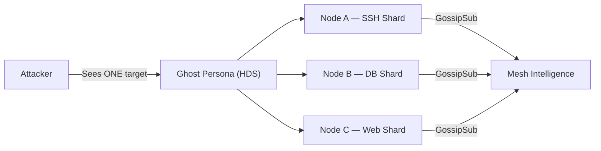
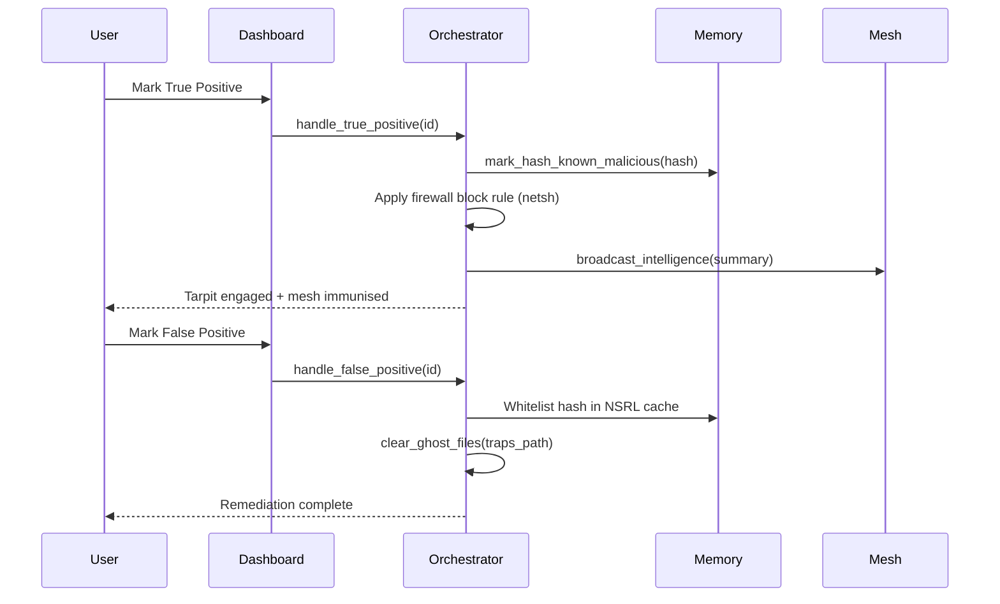
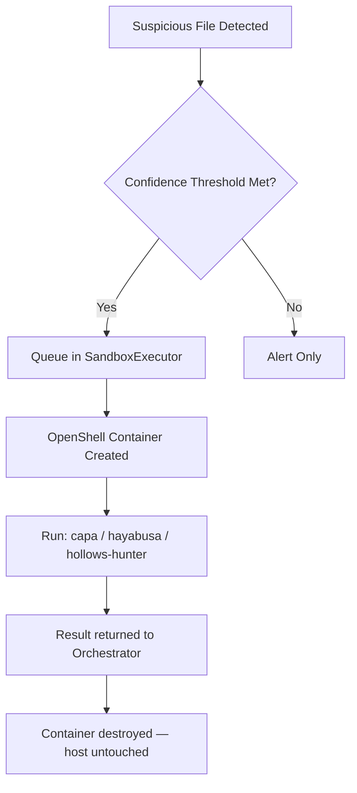
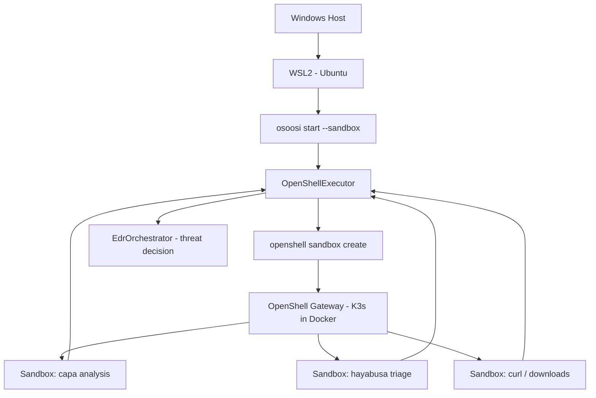
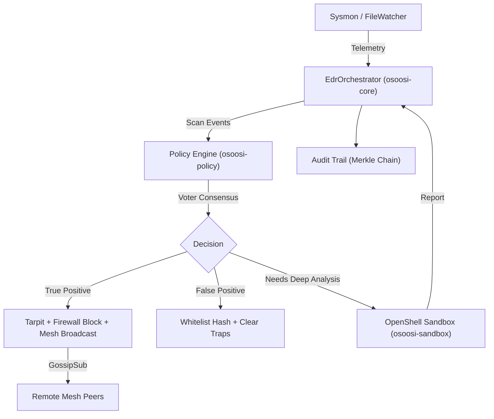

# OpenỌ̀ṣọ́ọ̀sì: The Sovereign Mesh Security Agent

> **Next-generation agentic EDR** — autonomous detection, federated intelligence, and self-healing security across Windows, Linux, and macOS.

---

## 🚀 Key Innovations

### 1. Holographic Deception Sharding (HDS)
Unlike traditional honeypots, HDS creates a **distributed hallucination** across the mesh.

- **Ghost Persona**: When an attacker is detected, the mesh generates a convincing fake environment.
- **Sharding**: The deception is split into shards — Node A simulates SSH, Node B simulates a database, Node C simulates a web server. Each shard is assigned via deterministic consensus hashing.
- **Effect**: An attacker scanning the network perceives one massive target, while their packets are processed by thousands of different nodes worldwide.



---

### 2. Einsteinian Relativistic Guard (Einstein Engine)
A temporal security engine that treats system events as a **Causal Manifold**.

- **Light-Cone Integrity**: Every event is hashed with its causal parent. Code injection without a valid causal history triggers a "Causal Decoherence" alert.
- **Temporal Dilation**: Measures the discrepancy between local system time and global mesh time — detects Sleeper Attacks and clock-skew exploits (TOCTOU).

---

### 3. Federated Reinforcement Loop (NEW)
The agent learns from analyst feedback and propagates intelligence across the mesh in real-time.

| Action | Effect |
|---|---|
| **Mark True Positive** | Confirms threat → adds hash to bloom filter → firewall block applied → broadcast to all peers |
| **Mark False Positive** | Whitelists hash/process in NSRL cache → clears ghost file traps → suppresses future alerts |



---

### 4. NVIDIA OpenShell Sandboxing
High-risk forensic analysis runs inside hardware-isolated containers.



- **Isolation**: Forensic tools run inside OpenShell. If malware exploits the analysis tool, it cannot escape to the host.
- **Zero-Persistence**: All temporary files written during analysis are wiped when the container is destroyed.
- **Egress Control**: No network calls out of the sandbox unless explicitly allowed by the egress policy YAML.

#### Windows + WSL2 OpenShell Mode

NVIDIA OpenShell v0.0.36 does not publish a native Windows package. On Windows desktops, Oshoosi can launch the Linux agent inside WSL2 with `osoosi start --wsl --sandbox`.



Setup is mostly automatic from Windows:

```powershell
.\target\release\osoosi.exe start --wsl --sandbox --sandbox-name my-agent-sandbox
```

The launcher:

- Launches WSL optional-component provisioning if Windows has not enabled WSL yet.
- Installs Ubuntu when WSL exists but no distro is present.
- Installs Rust and NVIDIA OpenShell inside WSL if missing.
- Builds the Linux Oshoosi binary in WSL if missing.
- Starts the Linux agent with `OSOOSI_SECURE_RUNTIME=openshell`.

Docker Desktop with WSL2 integration for Ubuntu is still required for OpenShell's Linux sandbox runtime. If Docker is unavailable inside WSL, Oshoosi stops with a Docker-specific remediation message.

Manual equivalent inside WSL2:

```bash
curl -LsSf https://raw.githubusercontent.com/NVIDIA/OpenShell/main/install.sh | sh
openshell --version
docker info
cd /mnt/d/harfile/OshoosiClaw
cargo build --release
```

From Windows after provisioning:

```powershell
.\target\release\osoosi.exe start --wsl --sandbox --sandbox-name my-agent-sandbox
```

---

## 🏗️ System Architecture



### Core Crates

| Crate | Role |
|---|---|
| `osoosi-core` | Main orchestrator: telemetry ingestion, consensus, response |
| `osoosi-wire` | P2P mesh networking via `libp2p` + GossipSub |
| `osoosi-policy` | Sigma rules, CISA KEV, OTX TAXII, NVD threat feeds |
| `osoosi-runtime` | Active response: Tarpits, Ghost Files, Process Kill |
| `osoosi-sandbox` | NVIDIA OpenShell isolation for high-risk tasks |
| `osoosi-memory` | SQLite persistence, bloom filter, NSRL bypass cache |
| `osoosi-repair` | Autonomous CVE discovery and patch application |
| `osoosi-telemetry` | Sysmon/auditd/FileWatcher event ingestion |

---

## ⚙️ Setup and Configuration

### Prerequisites
- **Rust**: Latest stable toolchain (`rustup update stable`)
- **Sysmon**: Required on Windows — installed automatically by the agent on first run
- **OpenShell CLI** *(optional)*: Required for sandboxed execution (`openshell` on PATH)

### Build
```bash
cargo build --release
```

### Run
```bash
# From project root (recommended — finds osoosi.toml automatically)
./target/release/osoosi start

# With hardware sandboxing
./target/release/osoosi start --sandbox --sandbox-name my-agent
```

> **Note**: The agent now automatically finds `osoosi.toml` even when started from `target/release/`.

### Configuration (`osoosi.toml`)
```toml
[external_api]
otx_api_key = "your-alienvault-key"
nvd_api_key  = "your-nvd-key"

[autonomy]
auto_quarantine_malware          = true
quarantine_confidence_threshold  = 0.95

[backup]
enabled     = false
backup_type = "file_sync"
```

---

## 🛡️ Sovereign Security Philosophy
OpenỌ̀ṣọ́ọ̀sì operates on the principle of **Decentralized Sovereignty**.
Threat intelligence is shared at mesh-speed across all peers, but every node remains its own Castle.
There is no central server to hack, no single point of failure. **The mesh is the security.**
