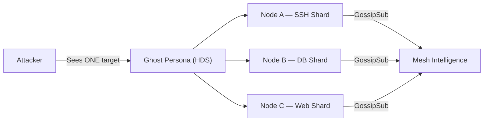
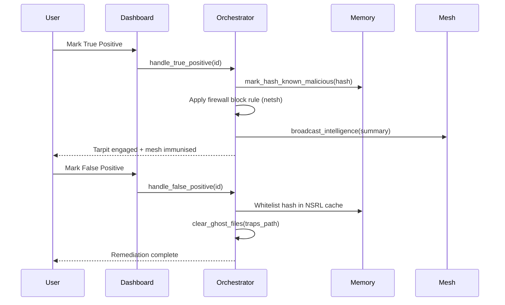
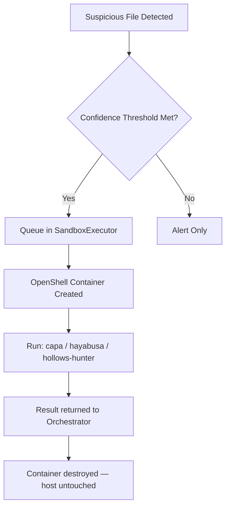
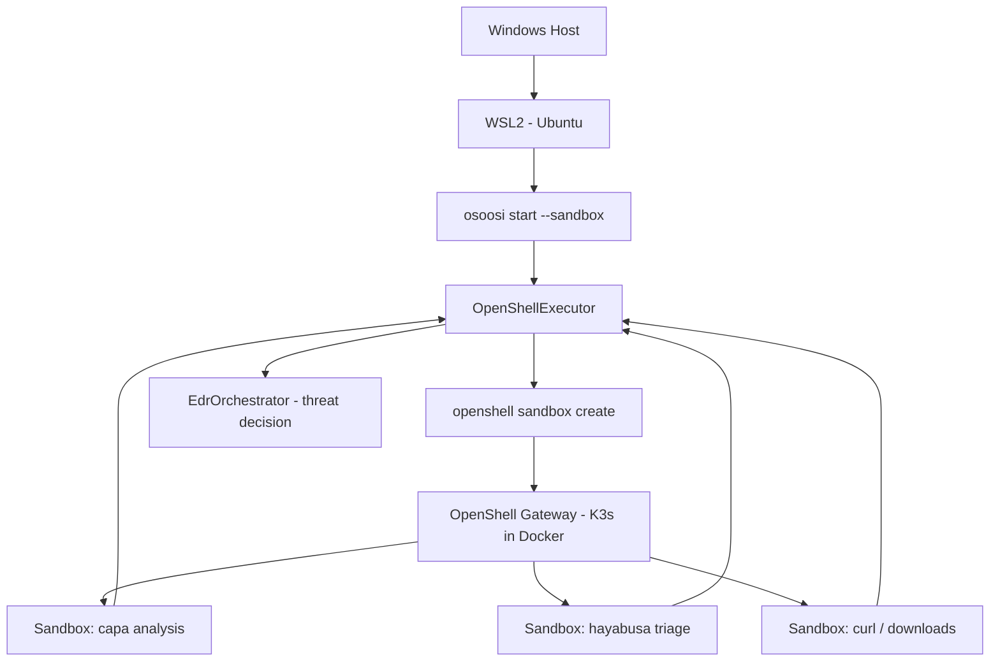
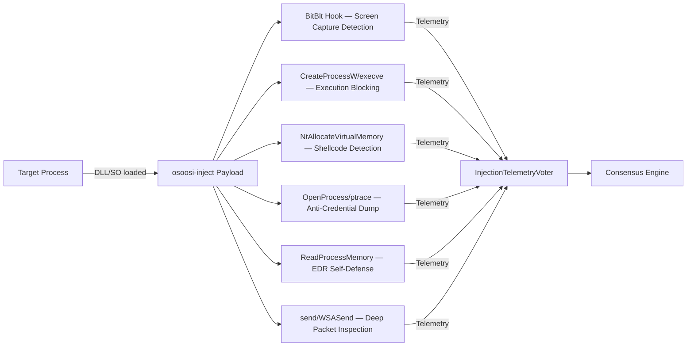
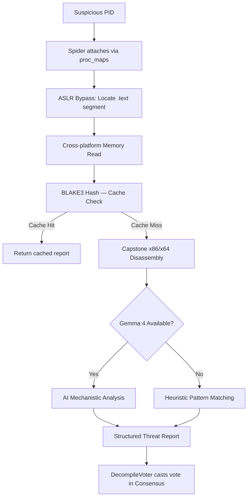
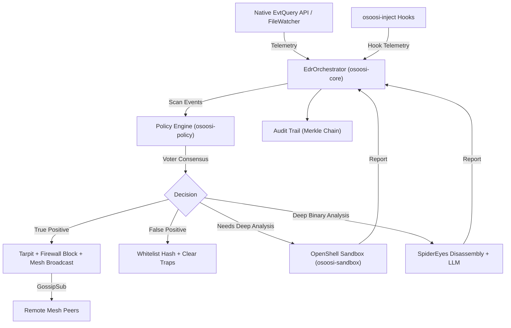
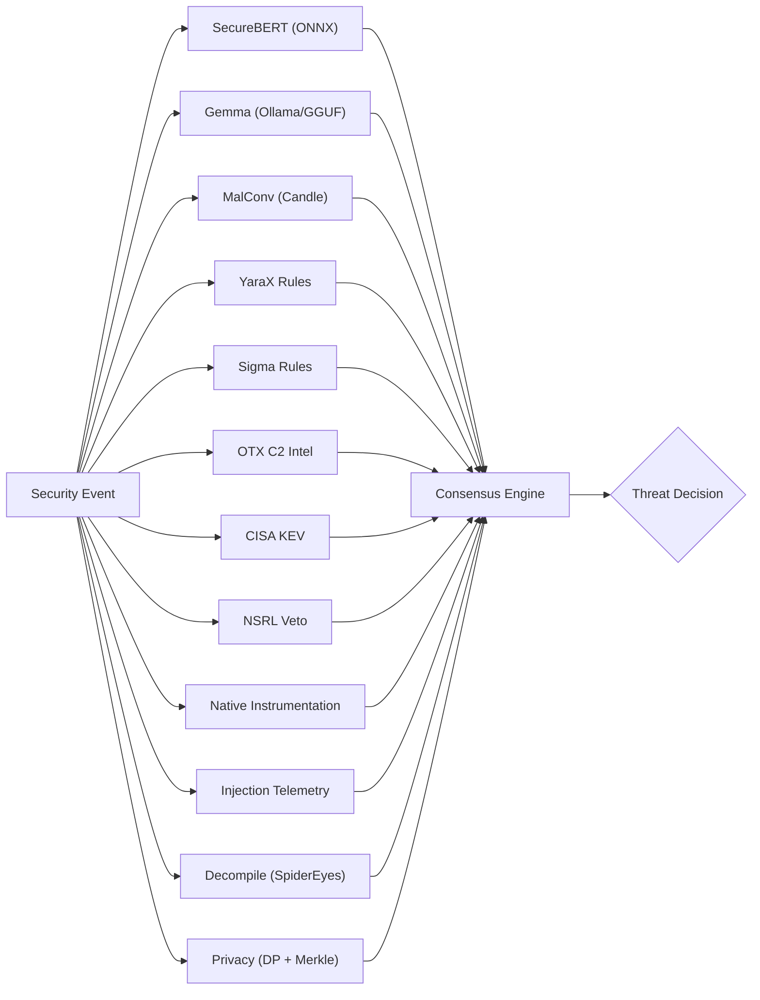

# OpenỌ̀ṣọ́ọ̀sì: The Sovereign Mesh Security Agent

> **Next-generation agentic EDR** — autonomous detection, federated intelligence, and self-healing security across Windows, Linux, and macOS.

---

## 🚀 Key Innovations

### 1. Holographic Deception Sharding (HDS)
Unlike traditional honeypots, HDS creates a **distributed hallucination** across the mesh.

- **Ghost Persona**: When an attacker is detected, the mesh generates a convincing fake environment.
- **Sharding**: The deception is split into shards — Node A simulates SSH, Node B simulates a database, Node C simulates a web server. Each shard is assigned via deterministic consensus hashing.
- **Effect**: An attacker scanning the network perceives one massive target, while their packets are processed by thousands of different nodes worldwide.


```mermaid
graph LR
    ATK[Attacker] -->|"Sees ONE target"| GHOST["Ghost Persona (HDS)"]
    GHOST --> N1["Node A — SSH Shard"]
    GHOST --> N2["Node B — DB Shard"]
    GHOST --> N3["Node C — Web Shard"]
    N1 & N2 & N3 -->|GossipSub| MESH["Mesh Intelligence"]
```

---

### 2. Einsteinian Relativistic Guard (Einstein Engine)
A temporal security engine that treats system events as a **Causal Manifold**.

- **Light-Cone Integrity**: Every event is hashed with its causal parent. Code injection without a valid causal history triggers a "Causal Decoherence" alert.
- **Temporal Dilation**: Measures the discrepancy between local system time and global mesh time — detects Sleeper Attacks and clock-skew exploits (TOCTOU).

---

### 3. Federated Reinforcement Loop
The agent learns from analyst feedback and propagates intelligence across the mesh in real-time.

| Action | Effect |
|---|---|
| **Mark True Positive** | Confirms threat → adds hash to bloom filter → firewall block applied → broadcast to all peers |
| **Mark False Positive** | Whitelists hash/process in NSRL cache → clears ghost file traps → suppresses future alerts |


```mermaid
sequenceDiagram
    participant User
    participant Dashboard
    participant Orchestrator
    participant Memory
    participant Mesh

    User->>Dashboard: Mark True Positive
    Dashboard->>Orchestrator: handle_true_positive(id)
    Orchestrator->>Memory: mark_hash_known_malicious(hash)
    Orchestrator->>Orchestrator: Apply firewall block rule (netsh)
    Orchestrator->>Mesh: broadcast_intelligence(summary)
    Orchestrator-->>User: Tarpit engaged + mesh immunised

    User->>Dashboard: Mark False Positive
    Dashboard->>Orchestrator: handle_false_positive(id)
    Orchestrator->>Memory: Whitelist hash in NSRL cache
    Orchestrator->>Orchestrator: clear_ghost_files(traps_path)
    Orchestrator-->>User: Remediation complete
```

---

### 4. NVIDIA OpenShell Sandboxing
High-risk forensic analysis runs inside hardware-isolated containers.


```mermaid
graph TD
    A["Suspicious File Detected"] --> B{Confidence Threshold Met?}
    B -->|Yes| C["Queue in SandboxExecutor"]
    C --> D["OpenShell Container Created"]
    D --> E["Run: capa / hayabusa / hollows-hunter"]
    E --> F["Result returned to Orchestrator"]
    F --> G["Container destroyed — host untouched"]
    B -->|No| H["Alert Only"]
```

- **Isolation**: Forensic tools run inside OpenShell. If malware exploits the analysis tool, it cannot escape to the host.
- **Zero-Persistence**: All temporary files written during analysis are wiped when the container is destroyed.
- **Egress Control**: No network calls out of the sandbox unless explicitly allowed by the egress policy YAML.

#### Windows + WSL2 OpenShell Mode

NVIDIA OpenShell v0.0.36 does not publish a native Windows package. On Windows desktops, Oshoosi can launch the Linux agent inside WSL2 with `osoosi start --wsl --sandbox`.


```mermaid
graph TD
    W["Windows Host"] --> WSL["WSL2 - Ubuntu"]
    WSL --> OS["osoosi start --sandbox"]
    OS --> OE["OpenShellExecutor"]
    OE --> CLI["openshell sandbox create"]
    CLI --> GW["OpenShell Gateway - K3s in Docker"]
    GW --> SBX1["Sandbox: capa analysis"]
    GW --> SBX2["Sandbox: hayabusa triage"]
    GW --> SBX3["Sandbox: curl / downloads"]
    SBX1 --> OE
    SBX2 --> OE
    SBX3 --> OE
    OE --> ORCH["EdrOrchestrator - threat decision"]
```

Setup is mostly automatic from Windows:

```powershell
.\target\release\osoosi.exe start --wsl --sandbox --sandbox-name my-agent-sandbox
```

The launcher:

- Launches WSL optional-component provisioning if Windows has not enabled WSL yet.
- Installs Ubuntu when WSL exists but no distro is present.
- Installs Rust and NVIDIA OpenShell inside WSL if missing.
- Builds the Linux Oshoosi binary in WSL if missing.
- Starts the Linux agent with `OSOOSI_SECURE_RUNTIME=openshell`.

Docker Desktop with WSL2 integration for Ubuntu is still required for OpenShell's Linux sandbox runtime. If Docker is unavailable inside WSL, Oshoosi stops with a Docker-specific remediation message.

---

### 5. Native In-Process Hooking Engine (Ported from OpenEDR)

OshoosiClaw includes a **cross-platform, in-process API hooking payload** (`osoosi-inject`) that gives the agent direct visibility into what every process on the system is doing at the API level.


```mermaid
graph LR
    PROC["Target Process"] -->|"DLL/SO loaded"| HOOK["osoosi-inject Payload"]
    HOOK --> H1["BitBlt Hook — Screen Capture Detection"]
    HOOK --> H2["CreateProcessW/execve — Execution Blocking"]
    HOOK --> H3["NtAllocateVirtualMemory — Shellcode Detection"]
    HOOK --> H4["OpenProcess/ptrace — Anti-Credential Dump"]
    HOOK --> H5["ReadProcessMemory — EDR Self-Defense"]
    HOOK --> H6["send/WSASend — Deep Packet Inspection"]
    H1 & H2 & H3 & H4 & H5 & H6 -->|Telemetry| VOTER["InjectionTelemetryVoter"]
    VOTER --> CONSENSUS["Consensus Engine"]
```

| Platform | Mechanism | Delivery |
|---|---|---|
| **Windows** | Detours (retour crate) — trampoline API hooking | VirtualAllocEx + CreateRemoteThread injection |
| **Linux** | LD_PRELOAD — libc symbol interposition | `/etc/ld.so.preload` or ptrace |
| **macOS** | DYLD_INSERT_LIBRARIES — dylib interposition | Environment variable on child processes |

#### Hooked APIs

| Hook | Windows API | Unix Equivalent | Detects |
|---|---|---|---|
| Screen Capture | `BitBlt` (GDI32) | N/A (X11 screenshot intercepted via sandbox) | Spyware, stalkerware, banking trojans |
| Execution | `CreateProcessW` | `execve` | Reverse shells, encoded PowerShell, cryptominers |
| Memory Allocation | `NtAllocateVirtualMemory` | `mmap` (future) | Process hollowing, shellcode injection |
| Process Handle | `OpenProcess` | `ptrace(PTRACE_ATTACH)` | Credential dumping (Mimikatz), EDR tampering |
| Memory Read | `ReadProcessMemory` | `ptrace(PTRACE_PEEKDATA)` | LSASS memory scraping, agent memory inspection |
| Network | `send` (ws2_32) | `send` (libc) | C2 beacons, DNS tunneling, darknet traffic |

---

### 6. Spider Eyes — Mechanistic Binary Analyst

SpiderEyes is Oshoosi's **live disassembly and AI reasoning engine**. It attaches to a running process, reads its executable memory segments (bypassing ASLR), disassembles the machine code with Capstone, and then feeds the assembly into a local LLM (Gemma 4) for mechanistic interpretability.


```mermaid
graph TD
    PID["Suspicious PID"] --> ATTACH["Spider attaches via proc_maps"]
    ATTACH --> ASLR["ASLR Bypass: Locate .text segment"]
    ASLR --> READ["Cross-platform Memory Read"]
    READ --> HASH["BLAKE3 Hash — Cache Check"]
    HASH -->|Cache Hit| CACHED["Return cached report"]
    HASH -->|Cache Miss| DISASM["Capstone x86/x64 Disassembly"]
    DISASM --> LLM{"Gemma 4 Available?"}
    LLM -->|Yes| AI["AI Mechanistic Analysis"]
    LLM -->|No| HEUR["Heuristic Pattern Matching"]
    AI --> REPORT["Structured Threat Report"]
    HEUR --> REPORT
    REPORT --> VOTE["DecompileVoter casts vote in Consensus"]
```

#### Heuristic Patterns (Fallback when LLM unavailable)

| Pattern | What It Detects |
|---|---|
| `JMP ESP` / `CALL ESP` / `JMP RSP` | ROP exploit gadgets |
| `AESENC` / `AESDEC` / `PXOR` | Ransomware encryption or encrypted C2 |
| `INT 0x2D` / `RDTSC` timing | Anti-debugging evasion |
| `CPUID` + comparison | VM/sandbox detection |
| `MOV CR0` / `WRMSR` / `SIDT` | Kernel rootkit / privilege escalation |
| `GetProcAddress` / `LoadLibrary` | Packed/obfuscated malware, shellcode loaders |
| Large NOP sleds (>20) | Classic exploit padding |
| `syscall` + ptrace patterns | Process injection / hollowing |
| Socket + connect sequences | C2 network beaconing |
| LSASS / SAM references | Credential harvesting |

---

## 🏗️ System Architecture


```mermaid
graph TD
    SYS["Native EvtQuery API / FileWatcher"] -->|Telemetry| ORCH["EdrOrchestrator (osoosi-core)"]
    INJ["osoosi-inject Hooks"] -->|Hook Telemetry| ORCH
    ORCH -->|Scan Events| POL["Policy Engine (osoosi-policy)"]
    POL -->|Voter Consensus| DEC{"Decision"}
    DEC -->|True Positive| TP["Tarpit + Firewall Block + Mesh Broadcast"]
    DEC -->|False Positive| FP["Whitelist Hash + Clear Traps"]
    DEC -->|Needs Deep Analysis| SBX["OpenShell Sandbox (osoosi-sandbox)"]
    DEC -->|Deep Binary Analysis| SPIDER["SpiderEyes Disassembly + LLM"]
    SBX -->|Report| ORCH
    SPIDER -->|Report| ORCH
    TP -->|GossipSub| PEERS["Remote Mesh Peers"]
    ORCH --> AUD["Audit Trail (Merkle Chain)"]
```

### Core Crates

| Crate | Role |
|---|---|
| `osoosi-core` | Main orchestrator: telemetry ingestion, consensus, response, maintenance |
| `osoosi-behavioral` | AI engine: Gemma 4 (ONNX), SecureBERT (ONNX), SmolLM (Candle), SpiderEyes |
| `osoosi-wire` | P2P mesh networking via `libp2p` + GossipSub |
| `osoosi-policy` | Sigma, CISA KEV, OTX TAXII, NVD feeds + LLM voter + Injection Telemetry voter |
| `osoosi-inject` | Cross-platform in-process API hooking payload (Windows DLL / Linux SO / macOS dylib) |
| `osoosi-runtime` | Active response: Tarpits, Ghost Files, Process Kill |
| `osoosi-sandbox` | NVIDIA OpenShell isolation for high-risk tasks |
| `osoosi-memory` | SQLite persistence, bloom filter, NSRL bypass cache, vacuum/prune maintenance |
| `osoosi-repair` | Autonomous CVE discovery and patch application |
| `osoosi-telemetry` | Native Win32 EvtQuery API / auditd / FileWatcher + DLL Injector |
| `osoosi-types` | Shared types, registry normalizer, self-protection path utilities |
| `osoosi-dp` | Differential privacy (Laplacian noise) for privacy-preserving detection |
| `osoosi-audit` | Merkle audit tree for tamper-proof decision logging |

---

## 🧠 AI Engine Architecture

OshoosiClaw uses a **multi-model consensus** architecture. Each model is a "voter" in the threat decision pipeline:


```mermaid
graph LR
    EVT["Security Event"] --> V1["SecureBERT (ONNX)"]
    EVT --> V2["Gemma (Ollama/GGUF)"]
    EVT --> V3["MalConv (Candle)"]
    EVT --> V4["YaraX Rules"]
    EVT --> V5["Sigma Rules"]
    EVT --> V6["OTX C2 Intel"]
    EVT --> V7["CISA KEV"]
    EVT --> V8["NSRL Veto"]
    EVT --> V9["Native Instrumentation"]
    EVT --> V10["Injection Telemetry"]
    EVT --> V11["Decompile (SpiderEyes)"]
    EVT --> V12["Privacy (DP + Merkle)"]
    V1 & V2 & V3 & V4 & V5 & V6 & V7 & V8 & V9 & V10 & V11 & V12 --> CON["Consensus Engine"]
    CON --> DEC{"Threat Decision"}
```

### All Registered Voters

| # | Voter | Source | Weight | Purpose |
|---|---|---|---|---|
| 1 | `SemanticVoter` | Semantic Engine | 0.7 | Detects command-line intent drift |
| 2 | `OtxVoter` | AlienVault OTX | 0.6–0.9 | C2 IP/hash/domain matching |
| 3 | `SigmaVoter` | Sigma Rules | 0.8 | Community detection rules |
| 4 | `GemmaVoter` | Gemma LLM (Ollama) | 0.9 | Deep reasoning about TTPs |
| 5 | `NativeVoter` | OpenEDR port | 0.5–1.0 | Self-protection, USB exfil, registry persistence |
| 6 | `NsrlVoter` | NIST NSRL | **-2.0** | Veto: suppresses known-good binaries |
| 7 | `DecompileVoter` | SpiderEyes | 0.98 | Live disassembly + AI mechanistic analysis |
| 8 | `ClamVoter` | ClamAV/YARA | 0.85 | Signature-based malware detection |
| 9 | `MalConvVoter` | MalConv ML | 0.6 | Neural network binary classification |
| 10 | `KevVoter` | CISA KEV | 0.5–0.85 | Known exploited vulnerabilities |
| 11 | `PrivacyVoter` | DP + Merkle | 0.8 | Privacy-preserving detection with audit trail |
| 12 | `InjectionTelemetryVoter` | Hook Payload | 0.7–1.0 | Screen capture, shellcode, cred dump, C2, reverse shells |

### Smart Engine Selection

The AI engine auto-selects the optimal backend based on hardware:

| Condition | Engine Selected | Why |
|---|---|---|
| CUDA GPU + CUDA Toolkit | **Native GGUF (Candle on GPU)** | In-process, fastest, no external deps |
| GPU + Ollama installed | **Ollama HTTP API** | llama.cpp backend, GPU-accelerated |
| CPU-only + Ollama | **Ollama HTTP API** | llama.cpp is 10x faster than Candle on CPU |
| CPU-only, no Ollama | **Native GGUF (Candle on CPU)** | Slow but functional, last resort |

### LLM Voter Rate Limiting

The LLM-Reasoning voter is rate-limited to prevent CPU/GPU saturation:

- **30-second cooldown** between LLM inference calls
- **Safe-process filter**: 30+ known Windows system processes (svchost, explorer, etc.) are skipped entirely
- **Minimum response check**: Responses < 10 chars are discarded (prevents phantom votes from timeouts)
- **Max 48 tokens**: Short classification output only — no essays

### Native Event Log Reading (Win32 EvtQuery API)

Windows telemetry uses the **native EvtQuery API** instead of spawning `wevtutil.exe` subprocesses:

- **Tamper-proof**: Attackers cannot bypass by renaming/blocking `wevtutil.exe`
- **Performance**: Direct API call vs subprocess spawn per poll cycle
- **Raw XML**: Events rendered directly in-process memory

---

## ⚙️ Setup and Configuration

### Prerequisites
- **Rust**: Latest stable toolchain (`rustup update stable`)
- **Sysmon**: Required on Windows — installed automatically by the agent on first run
- **Ollama** *(optional)*: Only needed if native GGUF loading fails
- **OpenShell CLI** *(optional)*: Required for sandboxed execution (`openshell` on PATH)

### Build
```bash
cargo build --release
```

### Run
```bash
# From project root (recommended — finds osoosi.toml automatically)
./target/release/osoosi start

# With hardware sandboxing
./target/release/osoosi start --sandbox --sandbox-name my-agent

# With dashboard UI
./target/release/osoosi start --dashboard
```

> **Note**: The agent now automatically finds `osoosi.toml` even when started from `target/release/`.

### Configuration (`osoosi.toml`)

All hardcoded values are now centralized. Environment variables override any value:

```toml
[ai]
reasoning_model  = "deepseek-r1:1.5b"    # Ollama/GGUF model name
llm_timeout_secs = 90                     # Kill inference after N seconds
reasoning_url    = "http://127.0.0.1:11434/v1/chat/completions"  # Ollama HTTP API
fallback_models  = ["gemma3:1b", "gemma3:4b", "qwen2.5:1.5b", "phi3:mini"]
colog_threshold  = 0.85                   # Anomaly detection threshold

[external_api]
otx_api_key = "your-alienvault-key"
nvd_api_key = "your-nvd-key"

[autonomy]
auto_quarantine_malware         = true
quarantine_confidence_threshold = 0.95
action_confidence_threshold     = 0.80

[backup]
enabled     = false
backup_type = "file_sync"
```

| Env Variable | Overrides | Default |
|---|---|---|
| `OSOOSI_REASONING_MODEL` | `ai.reasoning_model` | `deepseek-r1:1.5b` |
| `OSOOSI_LLM_TIMEOUT_SECS` | `ai.llm_timeout_secs` | `90` |
| `OSOOSI_REASONING_URL` | `ai.reasoning_url` | `http://127.0.0.1:11434/...` |
| `OSOOSI_NO_AI` | `ai.enabled` | `true` |
| `OSOOSI_DASHBOARD_PORT` | Dashboard port | `3030` |

---

## 🛡️ Sovereign Security Philosophy
OpenỌ̀ṣọ́ọ̀sì operates on the principle of **Decentralized Sovereignty**.
Threat intelligence is shared at mesh-speed across all peers, but every node remains its own Castle.
There is no central server to hack, no single point of failure. **The mesh is the security.**
