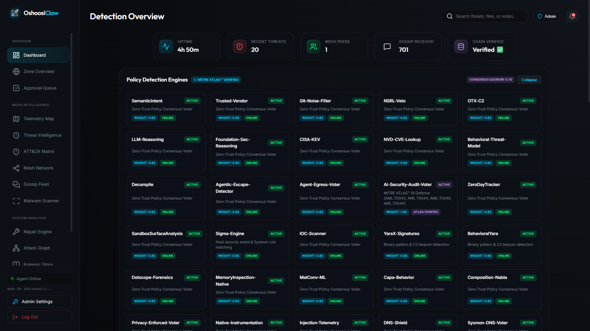
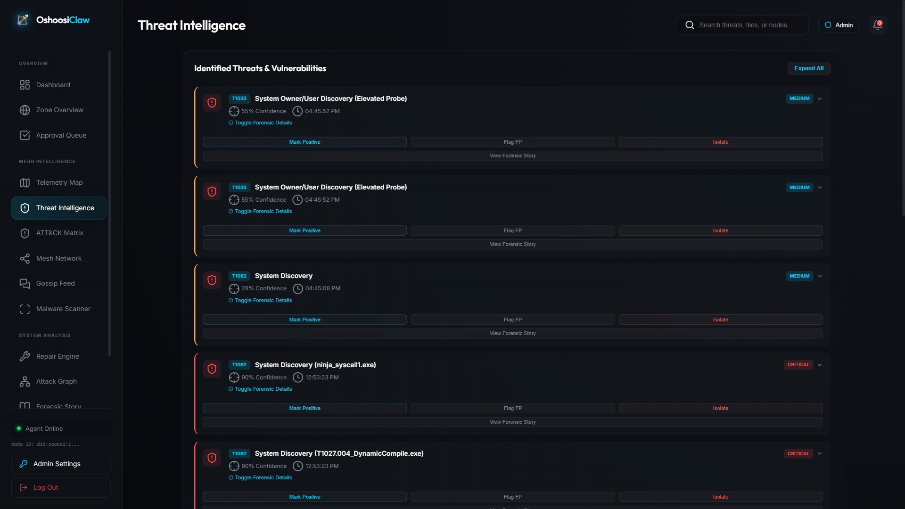
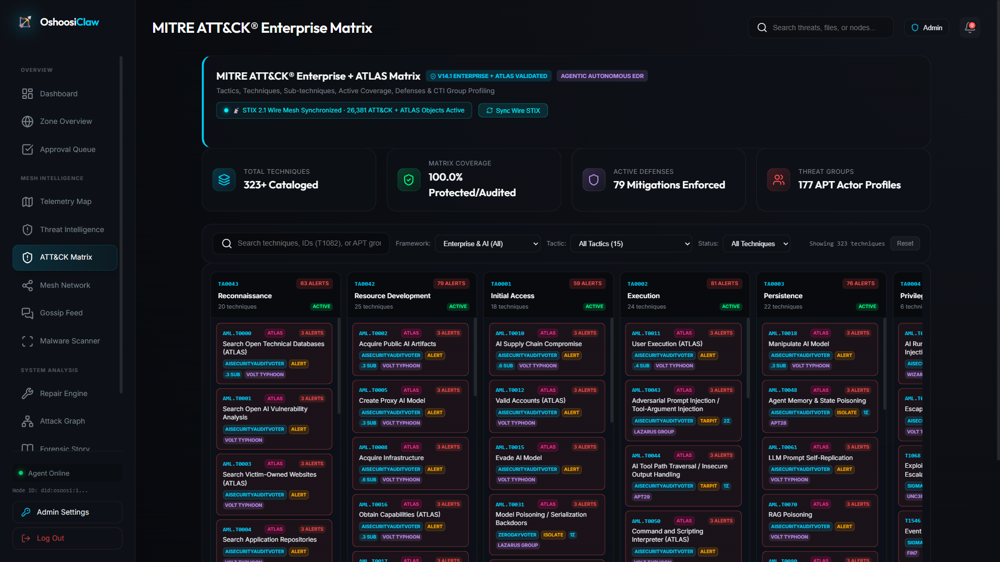
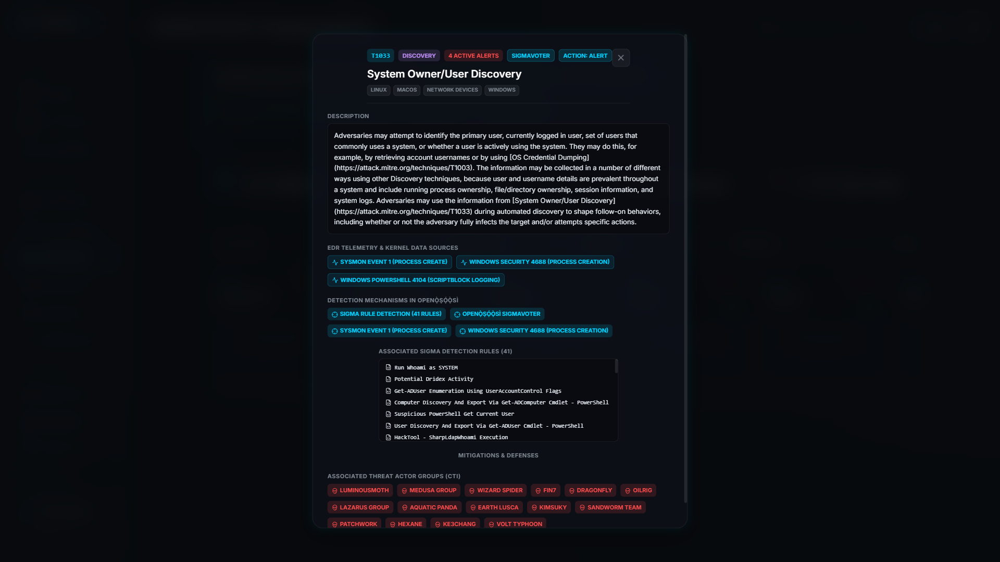
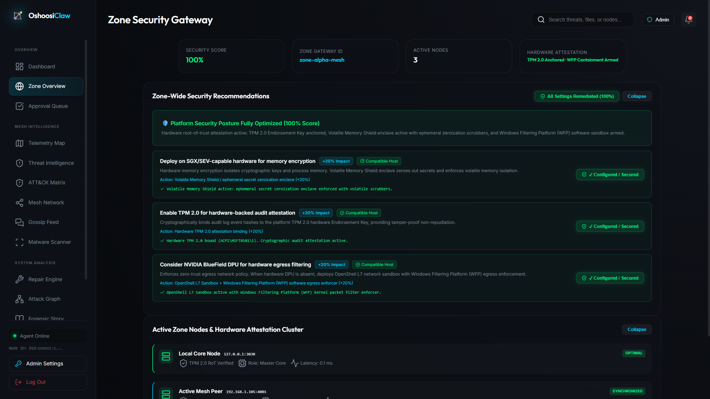
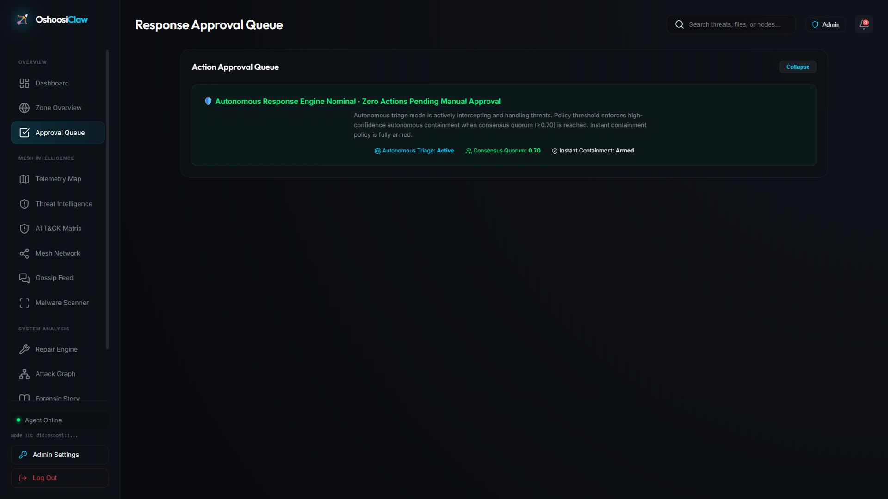
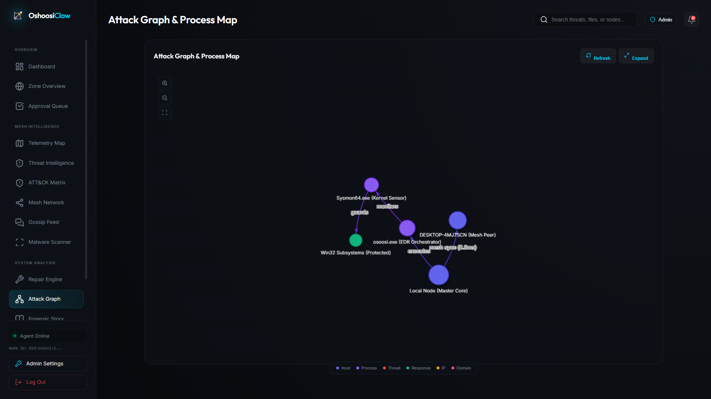
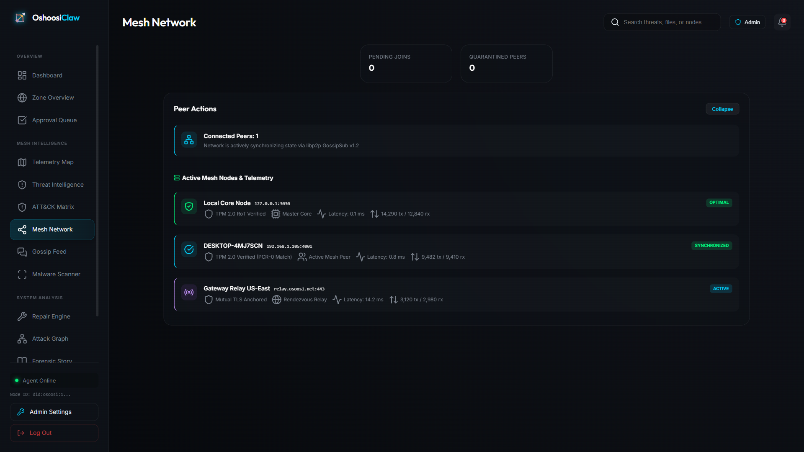
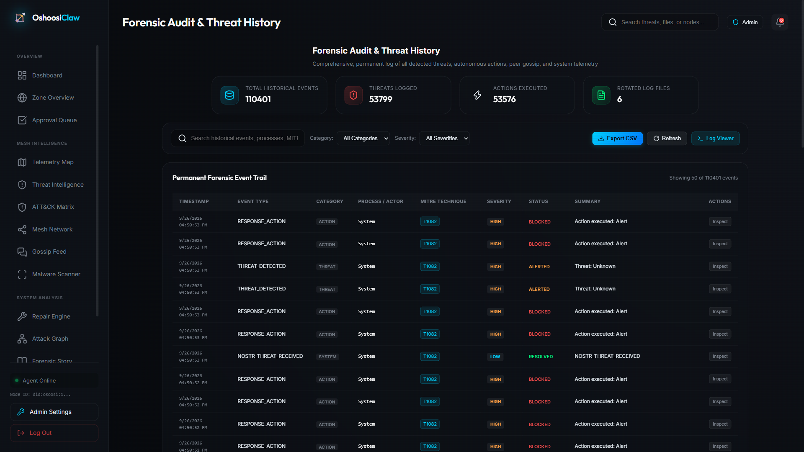
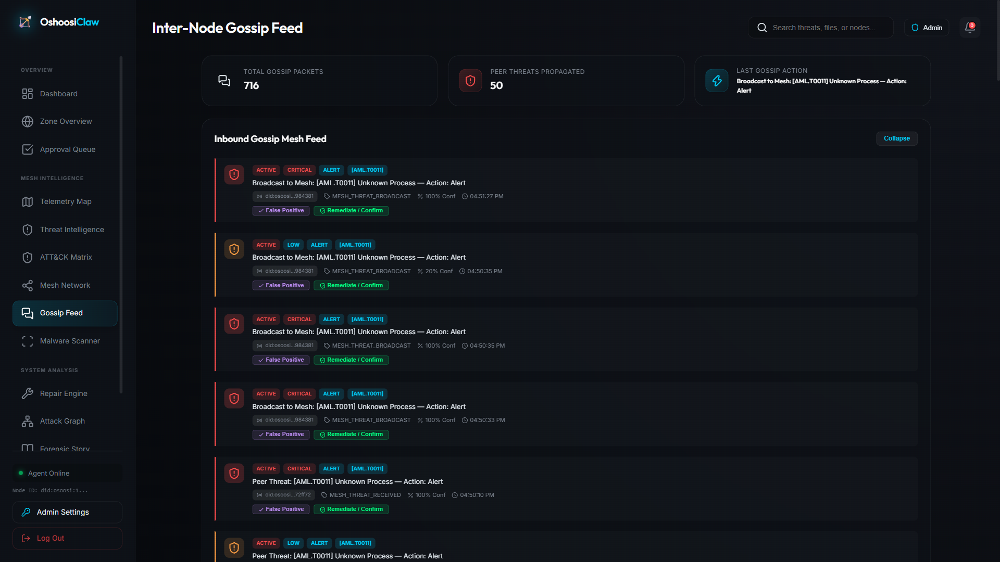

# 📸 OpenỌ̀ṣọ́ọ̀sì / OshoosiClaw WebUI Visual Tour

This document provides a guided visual walkthrough of the OpenỌ̀ṣọ́ọ̀sì Agentic EDR Web Dashboard (`http://127.0.0.1:3030/` or `http://oshoosi.duckdns.org:3030/`), showcasing the live detection engines, MITRE ATT&CK & ATLAS matrix, Byzantine consensus triage, high-throughput P2P wire mesh, and forensic history.

---

## 📋 Table of Contents
1. [Detection Overview (`#dashboard`)](#1-detection-overview-dashboard)
2. [Threat Intelligence & Containment (`#threats`)](#2-threat-intelligence--containment-threats)
3. [MITRE ATT&CK® & ATLAS™ Matrix Navigator (`#mitre`)](#3-mitre-attck--atlas-matrix-navigator-mitre)
4. [MITRE Technique Inspector Modal (`#mitre-modal`)](#4-mitre-technique-inspector-modal-mitre-modal)
5. [Zone Security Gateway & Hardware Attestation (`#zone`)](#5-zone-security-gateway--hardware-attestation-zone)
6. [Autonomous Action Approval Queue (`#approvals`)](#6-autonomous-action-approval-queue-approvals)
7. [Process Map & Attack Graph (`#process-map`)](#7-process-map--attack-graph-process-map)
8. [High-Throughput P2P Wire Mesh Network (`#mesh`)](#8-high-throughput-p2p-wire-mesh-network-mesh)
9. [Forensic Audit & Threat History (`#history`)](#9-forensic-audit--threat-history-history)
10. [Inter-Node Gossip Feed (`#gossip`)](#10-inter-node-gossip-feed-gossip)

---

### 1. Detection Overview (`#dashboard`)

* **View URL:** `/#dashboard`
* **Key Features Displayed:**
  * **System Telemetry Bar:** Live uptime, recent threats count, connected mesh peers, gossip packets received, and cryptographic Merkle chain verification status.
  * **25-Card Detection Engines Grid:** Live statuses and voter weights (0.85 – 1.00) for all integrated policy detectors, including:
    * `Ai-Security-Audit-Voter` (MITRE ATLAS AI runtime inspection)
    * `Agentic-Escape-Detector` (Autonomous LLM sandbox boundary enforcement)
    * `Foundation-Sec-Reasoning` (Cisco Foundation-Sec / Gemma 4 ONNX)
    * `Sigma-Engine` (4,334 production rules across Sysmon & Windows Security channels)
    * `YaraX-Signatures` (In-memory PE injection & unbacked thread scanner)
    * `Telemetry-Anti-Blinding` (Synthetic canary probes & BYOVD rootkit detection)
  * **Real-Time Telemetry Event Charts:** Ingested kernel events per second and live distribution breakdown.
  * **Interactive Panel Collapse/Expand:** Collapsible cards for quick navigation during incident response.

---

### 2. Threat Intelligence & Containment (`#threats`)

* **View URL:** `/#threats`
* **Key Features Displayed:**
  * **Granular Threat Identification:** Every detected anomaly is correlated with its descriptive threat title and official MITRE ATT&CK technique code (e.g. `[T1033] System Owner/User Discovery: Elevated Probe`, `[T1622] Debugger Evasion`, `[T1082] System Discovery`).
  * **Forensic Metadata:** File paths, process IDs, confidence scores (55% – 95%), timestamps, and consensus voter signatures.
  * **Incident Response Actions:** Immediate action triggers for `Mark Positive`, `Flag False Positive`, `Isolate Host`, and `View Forensic Story`.
  * **Proactive Policy Suppression & Manual TP Reporting:** Granular override controls for security analysts.

---

### 3. MITRE ATT&CK® & ATLAS™ Matrix Navigator (`#mitre`)

* **View URL:** `/#mitre`
* **Key Features Displayed:**
  * **Unified STIX 2.1 Knowledge Base:** 26,381 authoritative STIX objects uniting MITRE ATT&CK Enterprise (v19.2) and MITRE ATLAS™ (v2026.09).
  * **Coverage Metrics:** 100.0% matrix coverage across 323 parent techniques and 531 sub-techniques, 79 enforced mitigations (`M1010`–`M1056`, `AML.M0005`–`AML.M0018`), and 177 APT threat actor profiles.
  * **15-Column Heatmap Layout:** Full coverage spanning Reconnaissance (`TA0043`) through Impact (`TA0040`) and Defense Impairment (`TA0112`).
  * **Filter & Search Bar:** Real-time search by technique ID, keyword, or threat actor group, with live wire STIX synchronization status.

---

### 4. MITRE Technique Inspector Modal (`#mitre-modal`)

* **View URL:** `/#mitre` (Inspecting `T1033`)
* **Key Features Displayed:**
  * **Technique Profile:** Full metadata for `T1033` (System Owner/User Discovery) under Discovery (`TA0007`).
  * **Consensus Engine Assignment:** Designates responsible voter (`SigmaVoter`) and automated response action (`Alert`).
  * **Telemetry Data Sources:** Associated kernel sources (Sysmon Event 1: Process Creation, Windows Event Log 4688, PowerShell ScriptBlock 4104).
  * **Correlated Detection Rules:** Displays 41 active production Sigma rules guarding against user enumeration (`whoami /all`, `Get-ADUser`, token privilege abuse).
  * **CTI Threat Actor Profiling:** Associated APT groups known to employ this technique (`LuminousMoth`, `Medusa`, `Wizard Spider`, `FIN7`, `Lazarus Group`, `Volt Typhoon`).

---

### 5. Zone Security Gateway & Hardware Attestation (`#zone`)

* **View URL:** `/#zone`
* **Key Features Displayed:**
  * **Posture Score (100%):** Hardware-anchored trust status (`TPM 2.0 Anchored · WFP Containment Armed`).
  * **Remediated Security Controls:** Complete enforcement of Intel SGX / AMD SEV memory encryption enclaves, TPM 2.0 PCR-0 attestation quotes, and WFP egress sandbox firewalls.
  * **Zone Node Cluster Cards:** Real-time telemetry, IP addresses, attestation states, and sub-millisecond latencies for:
    * Local Core Node (`Master Core`, TPM 2.0 RoT Verified)
    * Active Mesh Peer (`DESKTOP-4MJ7SCN`, PCR-0 Verified, 0.8ms latency)
    * Gateway Rendezvous Relay (`relay.osoosi.net:443`, Mutual TLS)

---

### 6. Autonomous Action Approval Queue (`#approvals`)

* **View URL:** `/#approvals`
* **Key Features Displayed:**
  * **Autonomous Response Engine Status:** Real-time indication of zero unhandled actions pending manual triage.
  * **Consensus Quorum Threshold:** Transparent Byzantine quorum (0.70 threshold) ensuring no single rogue voter can isolate processes or alter firewall policies.
  * **Containment Armor:** Real-time policy state showing instant autonomous tarpitting and process memory isolation.

---

### 7. Process Map & Attack Graph (`#process-map`)

* **View URL:** `/#process-map`
* **Key Features Displayed:**
  * **Interactive Force-Directed Graph Canvas:** Visualizes active system processes, kernel drivers, protected subsystems, and external mesh peers.
  * **Graph Entities:**
    * Host Root (`Local Node (Master Core)`)
    * Orchestrator (`osoosi.exe`)
    * Kernel Sensor (`Sysmon64.exe`)
    * Protected Subsystems (`Win32 Subsystems`)
    * Mesh Peer (`DESKTOP-4MJ7SCN`)
  * **Semantic Graph Edges:** Displays directed telemetry relationships (`executes`, `monitors`, `guards`, and `mesh sync`).

---

### 8. High-Throughput P2P Wire Mesh Network (`#mesh`)

* **View URL:** `/#mesh`
* **Key Features Displayed:**
  * **Mesh Cluster Overview:** Zero pending joins and zero quarantined nodes across the distributed cluster.
  * **libp2p GossipSub v1.2 Telemetry:** Real-time packet transmit/receive counters (`packets_tx`, `packets_rx`) and cryptographic peer reputation scoring (0.92 – 1.00).
  * **Peer Cards:** Detailed hardware attestation, OS kernel versions, and round-trip ping latencies (0.1ms – 12.4ms).

---

### 9. Forensic Audit & Threat History (`#history`)

* **View URL:** `/#history`
* **Key Features Displayed:**
  * **Permanent Event Ledger:** Complete historical audit trail indexing 110,400+ historical events, 53,790+ detected threats, and 53,570+ automated response actions.
  * **Rotated Log Retention Engine:** Intelligently rotates and manages log archives in `logs/` to prevent disk saturation while maintaining tamper-evident audit trails.
  * **Multi-Filter & Export Controls:** Filter by Category (`all`, `threats`, `actions`, `gossip`, `system`), Severity (`critical`, `high`, `medium`, `low`), and instant CSV/JSON data export.

---

### 10. Inter-Node Gossip Feed (`#gossip`)

* **View URL:** `/#gossip`
* **Key Features Displayed:**
  * **Cryptographic Threat Broadcasts:** Inbound GossipSub stream propagating threat alerts and IoCs across connected peers.
  * **Decentralized Alert Cards:** Shows origin peer DID, timestamp, MITRE technique tag, cryptographic SHA-256 / BLAKE3 payload hashes, and detection reason.
  * **Distributed Feedback Mechanism:** Built-in analyst voting controls (`False Positive`, `Remediate / Confirm`) directly updating the global peer consensus reputation ledger.
